СВОД ПРАВИЛ

CN 430.1325800.2018

# МОНОЛИТНЫЕ КОНСТРУКТИВНЫЕ СИСТЕМЫ

## Правила проектирования

Издание официальное

## Предисловие

## Сведения о своде правил

1 ИСПОЛНИТЕЛЬ — АО «НИЦ «Строительство» — НИИЖБ им. А.А. Гвоздева

2 ВНЕСЕН Техническим комитетом по стандартизации ТК 465 «Строительство»

3 ПОДГОТОВЛЕН к утверждению Департаментом градостроительной деятельности и архитектуры Министерства строительства и жилищно-коммунального хозяйства Российской Федерации (Минстрой России)

4 УТВЕРЖДЕН приказом Министерства строительства и жилищно-коммунального хозяйства Российской Федерации от 25 декабря 2018 г. № 861/пр и введен в действие с 26 июня 2019 г.

5 ЗАРЕГИСТРИРОВАН Федеральным агентством по техническому регулированию и метрологии (Росстандарт)

6 ВВЕДЕН ВПЕРВЫЕ

В случае пересмотра (замены) или отмены настоящего свода правил соответствующее уве-

домление будет опубликовано в установленном порядке. Соответствующая информация, уведом-

ление и тексты размещаются также в информационной системе общего пользования — на офици-

альном сайте разработчика (Минстрой России) в сети Интернет

Настоящий свод правил не может быть полностью или частично воспроизведен, тиражирован и распространен в качестве официального издания на территории Российской Федерации без разрешения Минстроя России

## Содержание

1 Область применения..... 1  
2 Нормативные ссылки..... 1  
3 Термины и определения..... 2  
4 Общие положения..... 2  
5 Конструктивные решения монолитных железобетонных зданий и сооружений..... 3  
5.1 Конструктивные системы..... 3  
5.2 Несущие железобетонные конструкции..... 12  
6 Требования к расчету монолитных конструктивных систем..... 15  
6.1 Основные принципы расчета конструктивных систем и их элементов..... 15  
6.2 Требования к расчету конструктивных систем..... 15  
6.3 Требования к расчету железобетонных конструкций..... 18  
6.4 Методы расчета и расчетные модели монолитных конструктивных систем..... 23  
7 Конструирование несущих железобетонных конструкций..... 27  
Приложение А Общие положения по проектированию монолитных конструктивных систем с плитами перекрытий и покрытий с напрягаемой арматурой..... 34  
Библиография..... 39

## Введение

Настоящий свод правил разработан с учетом требований, установленных в федеральных законах от 27 декабря 2002 г. № 184-ФЗ «О техническом регулировании», от 30 декабря 2009 г. № 384-ФЗ «Технический регламент о безопасности зданий и сооружений» и содержит требования к расчету и проектированию монолитных конструктивных систем жилых и общественных зданий и сооружений, а также их несущих элементов и узлов.

Свод правил разработан авторским коллективом АО «НИЦ «Строительство» — НИИЖБ им. А.А. Гвоздева (руководитель работы — канд. техн. наук С.А. Зенин; доктор техн. наук Е.А. Чистяков, канд. техн. наук Р.Ш. Шарипов, О.В. Кудинов).

# МОНОЛИТНЫЕ КОНСТРУКТИВНЫЕ СИСТЕМЫ Правила проектирования

# Monolithic structural systems. Design rules

Дата введения — 2019—06—26

## 1 Область применения

Настоящий свод правил распространяется на проектирование конструктивных систем зданий (сооружений) гражданского назначения (жилые и общественные), в которых все основные несущие элементы (колонны, пилоны, стены, перекрытия, покрытия, фундаменты) выполняют из монолитного железобетона.

Свод правил не распространяется на проектирование конструкций усиления из монолитного же-

лезобетона.

## 2 Нормативные ссылки

В настоящем своде правил использованы нормативные ссылки на следующие документы:

ГОСТ 26633—2015 Бетоны тяжелые и мелкозернистые. Технические условия

ГОСТ 27751—2014 Надежность строительных конструкций и оснований. Основные положения

СП 2.13130.2012 Системы противопожарной защиты. Обеспечение огнестойкости объектов защиты (с изменением № 1)

СП 14.13330.2014 «СНиП II-7-81* Строительство в сейсмических районах» (с изменением № 1)

СП 16.13330.2017 «СНиП II-23-81* Стальные конструкции» (с изменением № 1)

СП 20.13330.2016 «СНиП 2.01.07-85* Нагрузки и воздействия» (с изменением № 1)

СП 22.13330.2016 «СНиП 2.02.01-83* Основания зданий и сооружений»

СП 24.13330.2011 «СНиП 2.02.03-85 Свайные фундаменты (с изменением № 1)

СП 28.13330.2017 «СНиП 2.03.11-85 Защита строительных конструкций от коррозии» (с изменением № 1)

СП 50.13330.2012 «СНиП 23-02-2003 Тепловая защита зданий»

СП 51.13330.2011 «СНиП 23-03-2003 Защита от шума» (с изменением № 1)

СП 63.13330.2012 «СНиП 52-01-2003 Бетонные и железобетонные конструкции. Основные положения» (с изменениями № 1, № 2, № 3)

СП 70.13330.2012 «СНиП 3.03.01-87 Несущие и ограждающие конструкции» (с изменениями № 1, № 3)

СП 112.13330.2011 «СНиП 21-01-97* Пожарная безопасность зданий и сооружений»

СП 266.1325800.2016 Конструкции сталежелезобетонные. Правила проектирования

СП 267.1325800.2016 Здания и комплексы высотные. Правила проектирования

СП 296.1325800.2017 Здания и сооружения. Особые воздействия

СП 311.1325800.2017 Бетонные и железобетонные конструкции из высокопрочных бетонов. Правила проектирования

СП 351.1325800.2017 Бетонные и железобетонные конструкции из легких бетонов. Правила проектирования

СП 385.1325800.2018 Защита зданий и сооружений от прогрессирующего обрушения. Правила проектирования. Основные положения

СП 387.1325800.2018 Железобетонные пространственные конструкции покрытий и перекрытий. Правила проектирования

Пр и меч а н и е — При пользовании настоящим сводом правил целесообразно проверить действие ссылоч-

ных документов в информационной системе общего пользования — на официальном сайте федерального органа

исполнительной власти в сфере стандартизации в сети Интернет или по ежегодному информационному указате-

лю «Национальные стандарты», который опубликован по состоянию на 1 января текущего года, и по выпускам

ежемесячного информационного указателя «Национальные стандарты» за текущий год. Если заменен ссылочный

документ, на который дана недатированная ссылка, то рекомендуется использовать действующую версию этого

документа с учетом всех внесенных в данную версию изменений. Если заменен ссылочный документ, на который

дана датированная ссылка, то рекомендуется использовать версию этого документа с указанным выше годом ут-

верждения (принятия). Если после утверждения настоящего свода правил в ссылочный документ, на который дана

датированная ссылка, внесено изменение, затрагивающее положение, на которое дана ссылка, то это положение

рекомендуется применять без учета данного изменения. Если ссылочный документ отменен без замены, то поло-

жение, в котором дана ссылка на него, рекомендуется применять в части, не затрагивающей эту ссылку. Сведения

о действии сводов правил целесообразно проверить в Федеральном информационном фонде стандартов.

## 3 Термины и определения

В настоящем своде правил применены термины по ГОСТ 27751, ГОСТ 26633, СП 20.13330, СП 63.13330, а также следующие термины с соответствующими определениями:

3.1 конструктивная система здания (сооружения): Совокупность взаимосвязанных несущих элементов здания (сооружения), обеспечивающих его прочность, жесткость и устойчивость на стадии возведения и стадии эксплуатации при действии всех расчетных нагрузок и воздействий.

3.2 монолитная конструктивная система: Конструктивная система здания (сооружения), все не-сущие элементы которого выполнены из монолитного железобетона.

3.3 ядро жесткости (здесь): Совокупность вертикальных несущих элементов (стен) здания (сооружения), образующих замкнутый контур в плане (или близкий к нему) и обеспечивающих общую пространственную жесткость конструктивной системы здания (сооружения).

## 4 Общие положения

4.1 Монолитные конструктивные системы проектируют по настоящему своду правил с учетом СП 63.13330. Узлы и сопряжения несущих элементов при проектировании монолитных конструктивных систем принимают преимущественно жесткими.

4.2 Конструктивная система должна обеспечивать прочность, жесткость и устойчивость здания (сооружения) на стадии возведения и в период эксплуатации при действии всех расчетных нагрузок и воздействий. В общем случае для монолитных конструктивных систем, их несущих элементов и узлов должны быть соблюдены общие требования пожаробезопасности, надежности, долговечности, тепло-и звукоизоляции, коррозионной стойкости, прочности, трещиностойкости и деформативности, установленные в ГОСТ 27751, СП 2.13130, СП 16.13330, СП 20.13330, СП 22.13330, СП 24.13330, СП 28.13330, СП 50.13330, СП 51.13330, СП 63.13330, СП 70.13330, СП 112.13330, [1].

4.3 Расчет и проектирование монолитных конструктивных систем при сейсмических воздействиях следует выполнять согласно СП 14.13330.

4.4 При проектировании монолитных конструктивных систем рекомендуется выбирать оптимальные в технико-экономическом отношении конструктивные решения с целью снижения материалоемкости и трудозатрат при производстве работ.

Проектирование монолитных конструктивных систем рекомендуется выполнять с учетом их жизненного цикла с учетом параметров долговечности, моделей разрушения, мониторинга состояния, оценки срока службы железобетонных элементов и т. п., включая рассмотрение вопросов снижения негативного воздействия на окружающую среду.

4.5 Несущие элементы в монолитных конструктивных системах должны быть сконструированы таким образом, чтобы с достаточной надежностью предотвратить возникновение предельных состоя-

ний всех видов. Это достигается выбором показателей качества материалов, назначением размеров и

конструированием согласно настоящему своду правил и действующим нормативным документам.

Надежность несущих элементов обеспечивают расчетом по предельным состояниям первой и второй групп путем использования расчетных значений нагрузок и характеристик материалов, с учетом уровня ответственности здания (сооружения).

Расчетные значения нагрузок и характеристик материалов определяют как произведение их нор-

мативных значений на коэффициенты надежности, соответствующие рассматриваемому предельному

состоянию.

Уровень ответственности для монолитных конструктивных систем принимают исходя из класса сооружения по ГОСТ 27751 и техническому заданию на проектирование.

При расчете монолитных конструктивных систем, их несущих элементов и узлов следует учитывать коэффициенты надежности по ответственности  $ \gamma_{n} $ , принимаемые согласно ГОСТ 27751.

4.6 Нормативные значения нагрузок и воздействий, коэффициентов надежности по нагрузке, коэффициентов сочетаний нагрузок, а также подразделение нагрузок на постоянные и временные (длительные и кратковременные) следует принимать в соответствии с СП 20.13330, разработанными проектными решениями и техническим заданием на проектирование.

4.7 Расчет монолитных конструктивных систем, их несущих элементов и узлов выполняют на действие вертикальных и горизонтальных постоянных и временных (кратковременных, длительных и особых) нагрузок и воздействий с учетом неблагоприятных сочетаний нагрузок согласно СП 20.13330 или соответствующих им усилий.

4.8 Материалы для несущих элементов монолитных конструктивных систем и их характеристики принимают в соответствии с разделом 6 СП 63.13330.2012, с разделом 6 СП 311.1325800.2017, а также с настоящим сводом правил.

4.9 Материалы для стальных элементов, применяемых в несущих железобетонных элементах (закладные детали, анкерные устройства и т. д.), принимают с учетом СП 16.13330 с обеспечением необходимой долговечности и огнестойкости согласно СП 2.13330, СП 28.13330, СП 112.13330, [1]. Материалы для стальных соединительных муфт механического соединения арматурных стержней принимают согласно приложению М СП 63.13330.2012.

4.10 В чертежах несущих железобетонных элементов должны быть указаны характеристики бе-

тона по прочности и морозостойкости (в необходимых случаях, в частности, для наружных подземных

конструкций и фундаментов — по водонепроницаемости).

4.11 В проектах необходимо указывать способ (или мероприятия) возведения монолитных конструктивных систем при отрицательных температурах (в зимнее время), обеспечивающий устойчивость здания (сооружения), прочность его несущих элементов и узлов в период возведения и эксплуатации.

4.12 Проектирование монолитных конструктивных систем зданий (сооружений) с повышенным уровнем ответственности (класс КС-3) выполняют при научно-техническом сопровождении проектирования.

4.13 Для обеспечения повышенной трещиностойкости и водонепроницаемости железобетонных элементов монолитных конструктивных систем, а также для увеличения прочности бетона элементов на растяжение могут быть применены самонапрягающиеся бетоны согласно подразделу 6.1 СП 63.13330.2012.

4.14 Для несущих элементов монолитных конструктивных систем должна быть выполнена расчет-

ная проверка обеспеченности принятого предела огнестойкости согласно СП 112.13330, [1].

4.15 Для несущих элементов монолитных конструктивных систем высотных зданий и комплексов (5.1.6) следует учитывать СП 267.1325800.

## 5 Конструктивные решения монолитных железобетонных зданий и сооружений

### 5.1 Конструктивные системы

5.1.1 В общем случае монолитная конструктивная система состоит из фундамента, вертикальных несущих элементов (колонн, пилонов и стен) и горизонтальных несущих элементов (плит и балок перекрытий и покрытия), взаимосвязь которых образует единую пространственную систему.

5.1.2 В зависимости от типа вертикальных несущих элементов (колонн, пилонов и стен) различают следующие монолитные конструктивные системы:

- каркасные — основные несущие вертикальные элементы — колонны или пилоны (рисунок 5.1);

- стеновые — основные несущие вертикальные элементы — стены (рисунок 5.2);

- каркасно-стеновые (смешанные) — несущие вертикальные элементы — колонны, пилоны и стены (рисунок 5.3).

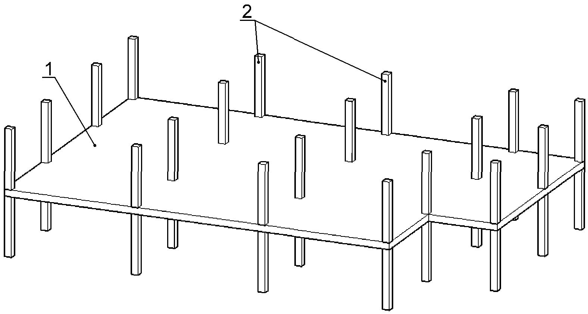

1 — плита перекрытия; 2 — колонны

Рисунок 5.1 — Каркасная конструктивная система

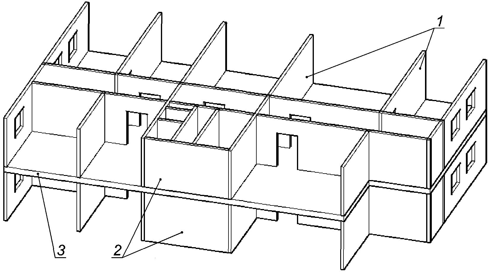

1 — стены; 2 — ядро жесткости; 3 — плита перекрытия

Рисунок 5.2 — Стеновая конструктивная система

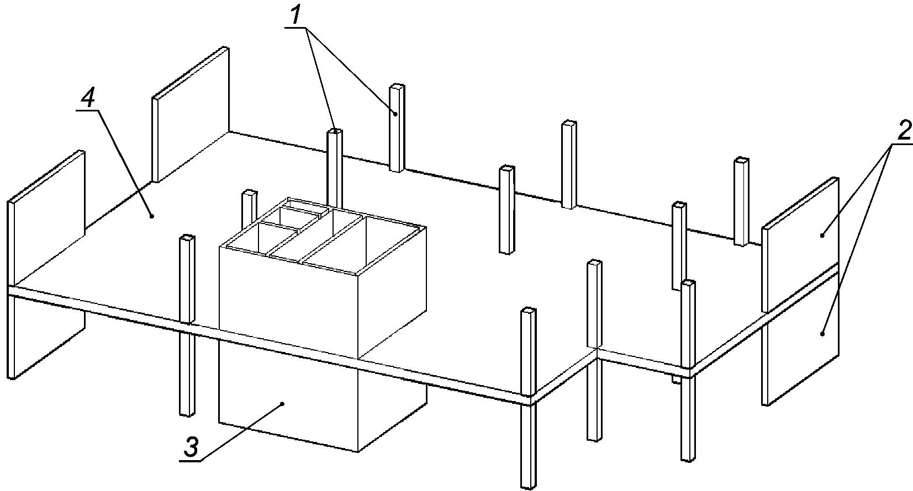

1 — колонны; 2 — стены; 3 — ядро жесткости; 4 — плита перекрытия

Рисунок 5.3 — Смешанная конструктивная система

Допускается предусматривать в здании (сооружении) несколько конструктивных систем (в частности, для наземной и подземной частей). Конструктивная система таких зданий (сооружений) — комбинированная.

5.1.3 МОНОЛИТНЫЕ КОНСТРУКТИВНЫЕ СИСТЕМЫ ВЫПОЛНЯЮТ ПО СВЯЗЕВОЙ, РАМНОЙ ИЛИ РАМНО-СВЯЗЕВОЙ СХЕМЕ.

При связевой схеме сопротивление горизонтальным нагрузкам осуществляется за счет работы вертикальных несущих элементов (стен, ядер жесткости) как консолей, защемленных в фундаменте.

При рамной схеме сопротивление горизонтальным нагрузкам осуществляется за счет работы рам, образуемых колоннами, пилонами и ригелями (условными ригелями), с жесткими узлами сопряжения.

При рамно-связевой схеме сопротивление горизонтальным нагрузкам осуществляется за счет со-

вместной работы связей (стен, ядер жесткости) и рам, образуемых колоннами и ригелями (условными

ригелями), с жесткими узлами сопряжения.

5.1.4 МОНОЛИТНЫЕ КОНСТРУКТИВНЫЕ СИСТЕМЫ ПРОЕКТИРУЮТ РЕГУЛЯРНЫМИ ИЛИ НЕРЕГУЛЯРНЫМИ В ПЛАНЕ И ПО ВЫСОТЕ ЗДАНИЯ (СООРУЖЕНИЯ).

Регулярная в плане конструктивная система предусматривает расположение вертикальных несущих элементов (колонн, пилонов, стен) по узлам сетки координационных осей здания (сооружения). При этом шаг вертикальных несущих элементов может отличаться друг от друга в том и другом направлении. Регулярная по высоте конструктивная система предусматривает одинаковую конструктивную систему на всех этажах здания (сооружения).

Нерегулярную несущую конструктивную систему рекомендуется проектировать таким образом, чтобы центр жесткости и центр масс конструктивной системы был как можно ближе к месту расположе-

ния равнодействующей вертикальной нагрузки.

Несущую конструктивную систему рекомендуется проектировать таким образом, чтобы вертикальные несущие элементы (колонны, пилоны, стены) были расположены от фундамента один над другим по высоте здания (сооружения), т.е. были соосными. В случае, когда вертикальные несущие элементы не выполнены по одной вертикальной оси, под «висячими» вертикальными несущими элементами устраивают распределительные (переходные) конструкции в виде толстых переходных плит, распределительных балок и балок-стенок. Для смешанных конструктивных систем в уровне переходных горизонтальных конструкций могут быть применены локальные увеличения толщины опорных сечений монолитных стен — вуты.

5.1.5 Для протяженных (длиной более 50 м) в плане зданий и сооружений, а также для зданий (сооружений), состоящих из разновысоких объемов (при перепаде высоты более 25 %), рекомендуется предусматривать вертикальные постоянные деформационные швы:

- температура-усадочные — для уменьшения усилий в конструкциях и ограничения раскрытия в них трещин вследствие температурах и усадочных деформаций;

- осадочные — для предотвращения образования и раскрытия трещин в конструкциях вследствие неравномерных осадок фундаментов.

Допускается устройство временных деформационных швов на период строительства с их последующим замоноличиванием после замыкания теплового контура здания (сооружения).

Вертикальные деформационные швы выполняют посредством:

- спаренных вертикальных несущих элементов, располагаемых на границе планировочных сек-

ций;

- опирания горизонтальных несущих элементов на консольные выступы вертикальных несущих элементов;

- опирания горизонтальных несущих элементов друг на друга с устройством подрезок.

Ширину вертикальных швов следует определять по расчету, но принимать не менее 20 мм в свету.

Температурные швы могут быть доведены только до фундаментов. При этом при проектировании большеразмерных (один из размеров в плане превышает длину температурного отсека) фундаментных плит или ростверков следует учитывать возможные дополнительные напряжения в них и деформации в результате температурных воздействий, усадки и тепловыделения при гидратации бетона (6.2.16).

Расстояния между температурно-усадочными швами (длины температурных отсеков) монолитных конструктивных систем определяют расчетом согласно 6.2.16.

Осадочные швы должны разделять здание (сооружение), включая фундаменты, на изолированные отсеки.

Осадочные швы устраивают в случаях, когда неравномерные осадки основания (относительная разность осадок) в обычных грунтовых условиях превышают предельно допустимые значения, регламентируемые СП 22.13330.

Если по расчету обеспечена прочность основания и несущих элементов и раскрытие трещин в несущих железобетонных элементах не превышает предельно допустимые значения, осадочный шов допускается не устраивать.

5.1.6 Для зданий небольшой этажности могут быть применены все виды конструктивных систем, для зданий средней этажности — целесообразна каркасно-стеновая и стеновая конструктивные системы, для высотных зданий — целесообразна стеновая конструктивная система, в том числе ствольного типа. Внутренний ствол образуется стенами ядра жесткости, наружный — наружным контуром несущих монолитных колонн или пилонов.

К зданиям небольшой этажности относят здания высотой не более 50 м, средней этажности — высотой не более 75 м, к высотным — высотой более 75 м.

5.1.7 Конструкцию и тип фундаментов в общем случае принимают с учетом фактических инженер-

но-геологических условий участка строительства, а также действующих нагрузок на основание.

Для зданий (сооружений) применяют различные типы фундаментов из монолитного железобетона (рисунок 5.4): отдельные (столбчатые), ленточные, плитные или свайные (в том числе комбинированные свайно-плитные). При соответствующем расчетном обосновании допускается применение других видов фундаментов (ребристых, коробчатых и пр.).

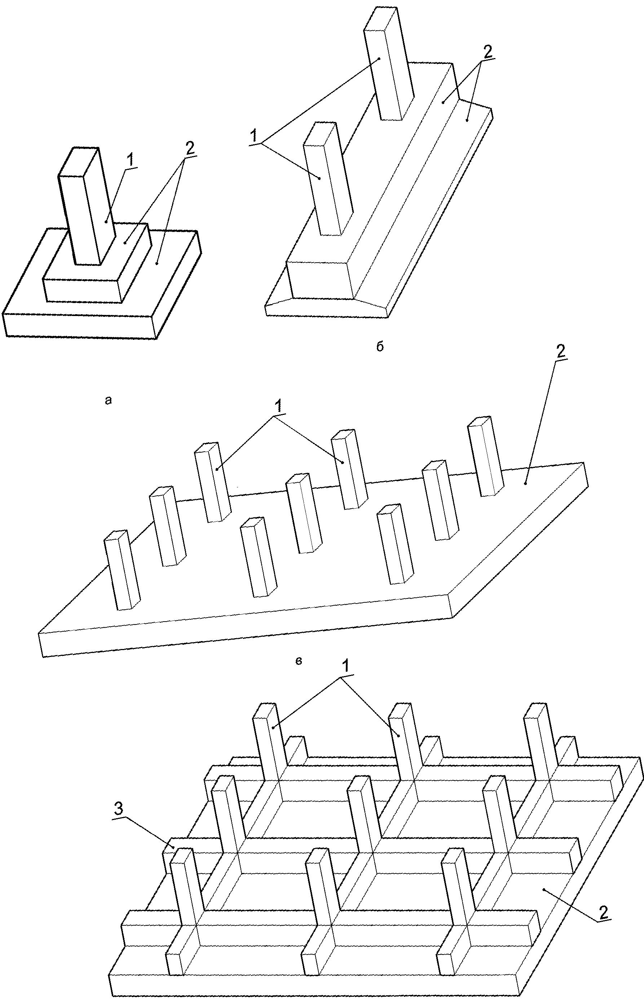

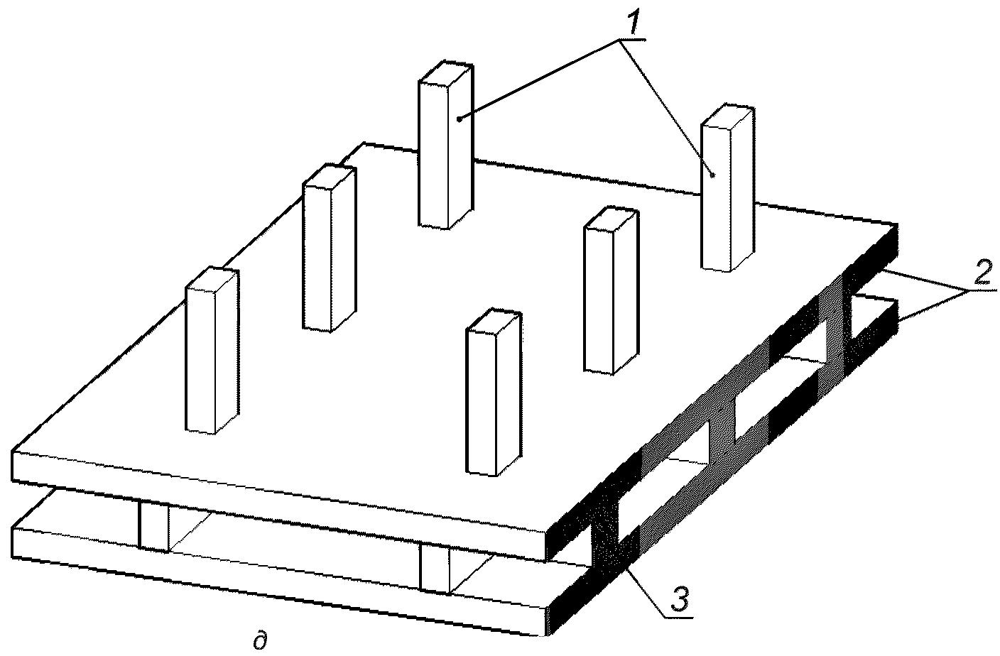

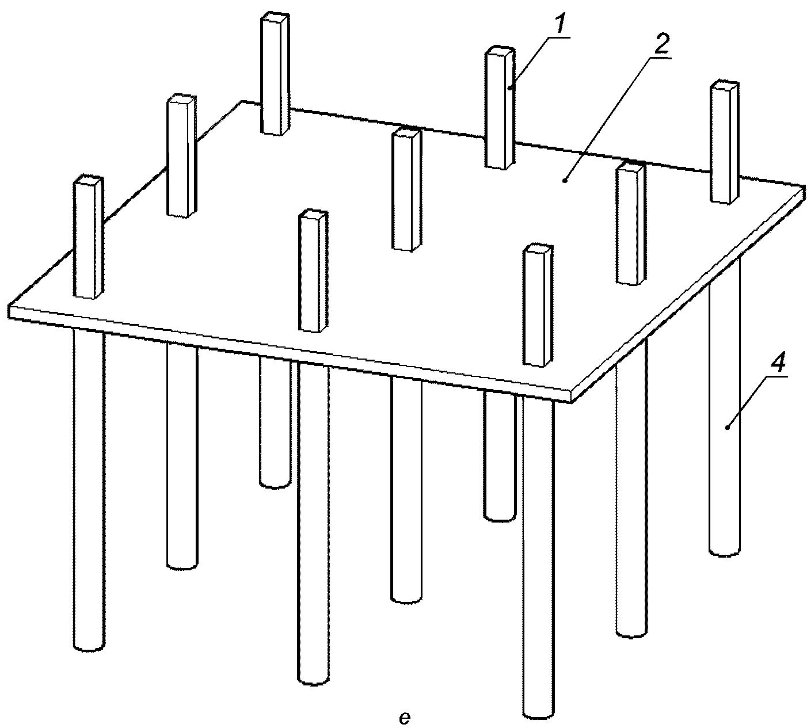

а — столбчатый; б — ленточный; в — плитный сплошной; г — плитный ребристый; д — плитный коробчатый; е — свайный; 1 — колонны; 2 — фундаментные плиты и ленты; 3 — ребра фундаментных плит; 4 — сваи

### Рисунок 5.4 — Фундаменты для монолитных конструктивных систем

5.1.8 Колонны принимают с поперечным сечением прямоугольной (квадратной), круглой и других форм (рисунок 5.5). К колоннам следует относить вертикальные (или наклонные) несущие элементы с поперечными сечениями, имеющими соотношение $b/a \leq 2,5$ или $h_{3T}/b > 3$ ($b$ — наибольший размер поперечного сечения колонны; $h_{3T}$ — высота

этажа в свету). К пилонам относят вертикальные (или наклонные) несущие элементы с соотношением  $ 2,5 \leq b/a \leq 4 $ . Колонны и пилоны с более вытянутыми поперечными сечениями, выходящими за указанные соотношения, следует относить к стенам.

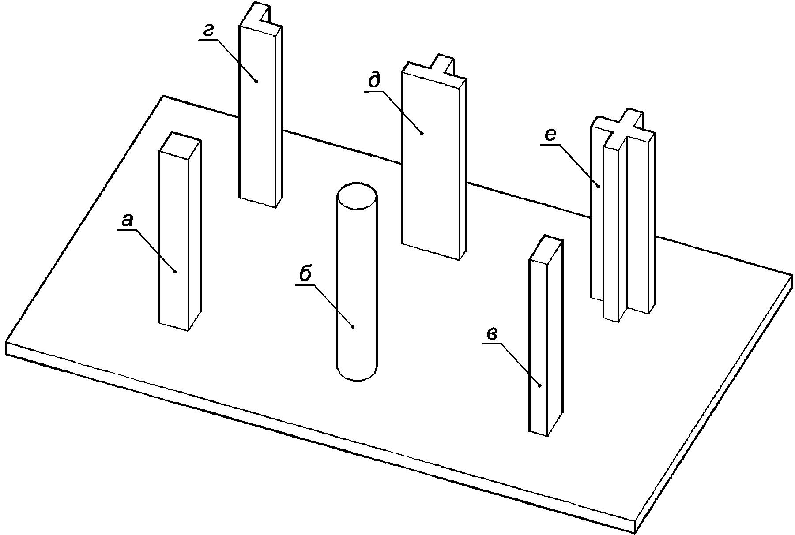

а — квадратное; б — круглое; в — прямоугольное; г — Г-образное (уголковое); д — Т-образное (тавровое); е — крестообразное

Рисунок 5.5 — Поперечные сечения колонн монолитных конструктивных систем

5.1.9 Несущие стены в плане принимают отдельно стоящими; продольными и поперечными; пере-

крестными, образующими вертикальные монолитные ядра жесткости и стволы.

В высотных зданиях (5.1.6) для повышения общей пространственной жесткости конструктивных систем могут быть применены стены-аутригеры, связывающие внутренние монолитные ядра жесткости и наружный контур вертикальных несущих конструкций здания.

5.1.10 Плиты применяют в безбалочных и балочных (в сочетании с балками) перекрытиях.

К плитам относят элементы с соотношениями размеров a > 5t (а — наименьший размер рядовой ячейки плиты в плане, t — толщина плиты). К балкам относят элементы с соотношением размеров I > 3h (I — размер пролета балки, h — высота элемента. В противном случае такие балки относят к балкам-стенкам (или к высоким балкам).

Конструкцию безбалочных перекрытий принимают в виде плоских плит (рисунок 5.6, а), плит с капителями (рисунок 5.6, г) или в комбинированном варианте. Кроме того, допускается устройство контурных балок по свободным краям перекрытия (рисунок 5.6, а).

В конструкциях балочных перекрытий расположение и шаг балок принимают в одном или двух направлениях с учетом шага вертикальных несущих конструкций (рисунок 5.6, б, в, д, е). Ширину балок принимают преимущественно не более габаритного размера колонны и пилона, высоту балок — не менее толщины плитной части перекрытий.

Допускается для размещения инженерных сетей и звукоизоляции устройства гладких потолков и т. п. принимать размещение балок в перекрытиях ребрами вверх. Конструкции балочных перекрытий с частым шагом балок (кессонные) следует применять преимущественно в регулярных конструктивных системах.

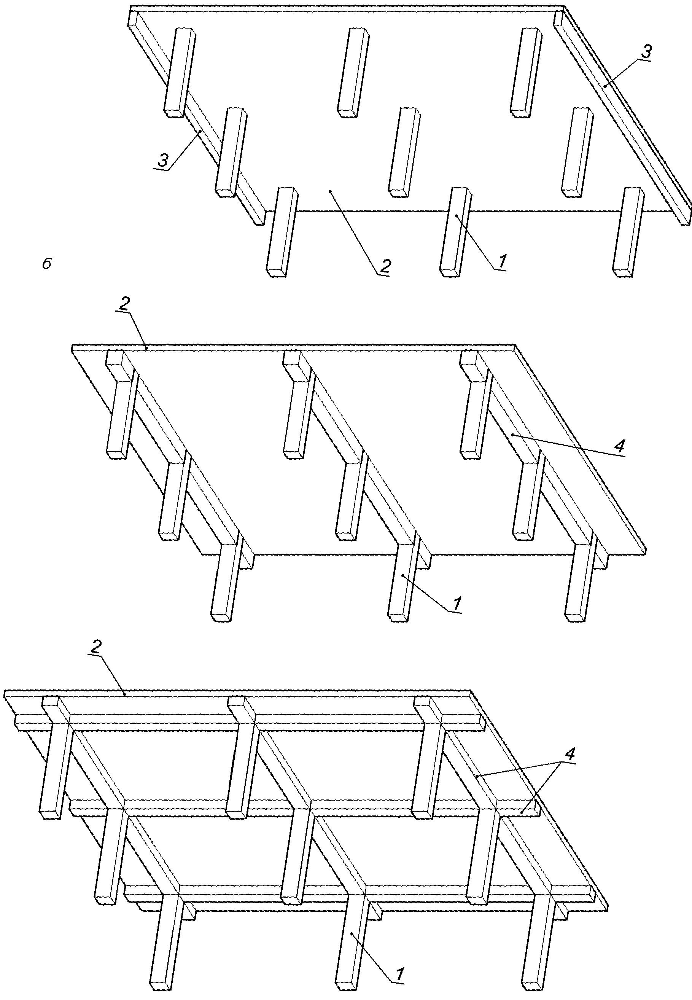

СП 430.1325800.2018

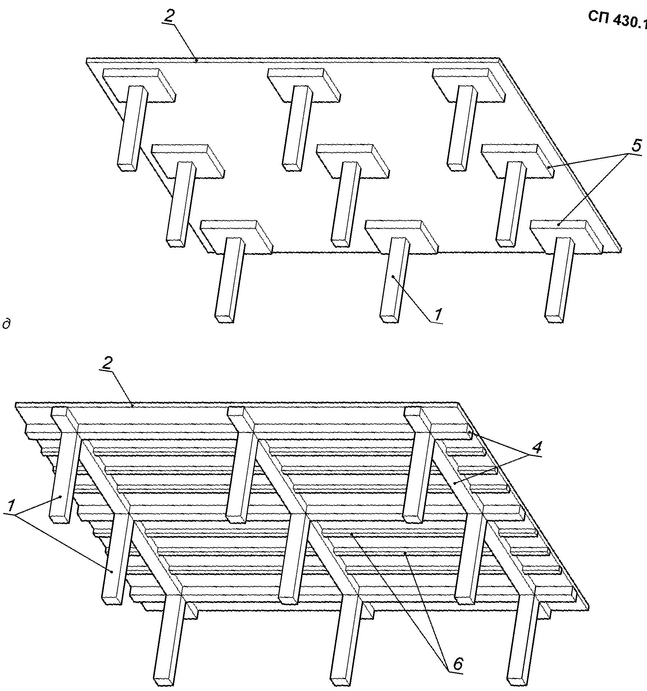

а — плоская плита; 6 — плита с балками в одном направлении; в — плита с балками в различных направлениях; г — плита с капителями; д — плита с главными и второстепенными балками; е — кессонная плита; 1 — колонны; 2 — плита сплошная; 3 — контурная балка; 4 — главная балка (в створах колонн); 5 — капитель; 6 — второстепенная балка; 7 — ребра кессонного перекрытия

Рисунок 5.6 — Плиты безбалочных и балочных перекрытий в монолитных конструктивных системах

### 5.2 Несущие железобетонные конструкции

5.2.1 Основные несущие элементы монолитных конструктивных систем — фундаменты, колонны, пилоны, стены, плиты и балки перекрытий и покрытий. Несущие элементы проектируют железобетонными монолитными с установкой расчетного и конструктивного продольного и поперечного армирования согласно СП 63.13330 и подразделу 6.3.

5.2.2 Фундаменты проектируют на естественном и свайном основаниях с учетом фактических инженерно-геологических условий участка строительства в виде отдельных (столбчатых) фундаментов под колонны, ленточных фундаментов, плитных фундаментов, свайных фундаментов и свайно-плитных (комбинированных) фундаментов.

5.2.3 МОНОЛИТНЫЕ ЛЕНТОЧНЫЕ ФУНДАМЕНТЫ ВЫПОЛНЯЮТ В ВИДЕ ОТДЕЛЬНЫХ ИЛИ ПЕРЕКРЕСТНЫХ ЛЕНТ ПОД ВЕРТИКАЛЬНЫЕ НЕСУЩИЕ КОНСТРУКЦИИ НИЖНЕГО ЭТАЖА ЗДАНИЯ (СООРУЖЕНИЯ) И ИМЕЮТ ПРЯМОУГОЛЬНОЕ ИЛИ СТУПЕНЧАТОЕ ПОПЕРЕЧНОЕ СЕЧЕНИЕ (РИСУНОК 5.4, 6).

5.2.4 Плитные фундаменты (рисунок 5.4, в) выполняют из монолитного железобетона под всей площадью здания (сооружения). Толщину плитных фундаментов принимают постоянной или переменной и назначают по результатам инженерно-геологических изысканий, расчетов по прочности и деформативности и по конструктивным требованиям 5.2.7.

5.2.5 Ребристые и коробчатые фундаменты состоят из плитных и стеновых элементов (рисунок 5.4, г, д). Такие фундаменты могут быть применены для повышения устойчивости надземной части здания (сооружения) и для использования подземного пространства в качестве технических помещений.

5.2.6 Свайные фундаменты выполняют из отдельных железобетонных свай (забивных, буронабивных, буроинъекционных и пр.) и монолитных плитных или ленточных фундаментных ростверков под вертикальными несущими конструкциями нижнего этажа.

Свайно-плитные фундаменты выполняют из монолитного железобетона под всей площадью здания (сооружения) в виде фундаментной плиты постоянной или переменной толщины и свай (забивных, буронабивных, буроинъекционных и пр.).

Тип и расположение свай по полю фундамента следует выбирать в зависимости от конструктив-

ной системы здания (сооружения), нагрузок, приходящихся на сваи, и инженерно-геологических услов-

вий основания.

5.2.7 Основные конструктивные параметры плоских фундаментных плит — геометрические размеры (толщина плиты), класс бетона по прочности на сжатие и содержание продольной и поперечной арматуры, определяемые в зависимости от реактивного давления грунта основания и шага колонн, пилонов и стен, а также марка по водонепроницаемости.

При проектировании рекомендуется принимать оптимальные конструктивные параметры фунда-

ментных плит, устанавливаемые на основе технико-экономического анализа. Толщину сплошных моно-

литных фундаментных плит рекомендуется принимать не менее 0,5 м и не более 3,0 м. Класс бетона

по прочности на сжатие принимают не менее B20, коэффициент продольного армирования не менее

0,3 %, а марку по водонепроницаемости — не менее W6.

В первом приближении допускается толщину плоской фундаментной плиты на естественном основании назначать равной  $ 1/65 \div 1/50 h_{3d} $ , где  $ h_{3d} $  — строительная высота здания (сооружения), равная расстоянию от верха фундамента до срединной плоскости плиты покрытия. Толщину плоских фунда- ментных плит в общем случае назначают из условия обеспечения прочности, включая прочность на продавливание (колоннами, пилонами или сваями), жесткости и трещиностойкости.

В необходимых случаях в местах расположения вертикальных несущих элементов (колонн, пи-

лонов и свай) предусматривают поперечное армирование, определяемое расчетом, также допускается

местное увеличение толщины плиты.

5.2.8 Основные конструктивные параметры колонн из монолитного железобетона — их высота, размеры поперечного сечения, класс бетона по прочности на сжатие и содержание продольной арматуры (процент армирования), определяемые в зависимости от высоты здания (сооружения), нагрузки на перекрытия (с учетом собственного веса перекрытий) и шага колонн.

При проектировании рекомендуется принимать оптимальные конструктивные параметры колонн, устанавливаемые на основе технико-экономического анализа. При этом минимальный размер квадратного и круглого поперечного сечения колонн следует принимать из условия обеспечения требований по гибкости по 10.2.2 СП 63.13330.2012, и не менее 300 мм, для колонн с вытянутым поперечным сечением и пилонов — не менее 200 мм. Класс бетона по прочности на сжатие принимают не менее B25, процент армирования в любом сечении (включая участки с нахлесточным соединением арматуры) — не более 10 %.

5.2.9 Конструктивные параметры колонн принимают преимущественно одинаковыми на одном уровне перекрытий в регулярных конструктивных системах. В нерегулярных конструктивных системах, а также с целью оптимизации решений при соответствующем расчетном обосновании допускается предусматривать различные конструктивные параметры колонн с учетом их расположения и восприятия нагрузок (средние, крайние, угловые).

5.2.10 В случаях, когда технико-экономический анализ конструктивных параметров колонн показывает, что требуемое армирование превышает максимальные значения, приведенные в 5.2.8, применяют сталежелезобетонные, в том числе трубобетонные, колонны.

Проектирование сталежелезобетонных конструкций, а также конструкций из высокопрочных бетонов выполняют по СП 266.1325800, СП 311.1325800.

5.2.11 Основные конструктивные параметры стен — размеры (толщина стен), класс бетона по прочности на сжатие и содержание вертикальной арматуры (процент армирования), определяемые в зависимости от высоты здания (сооружения), нагрузки на перекрытия, шага стен.

При проектировании рекомендуется принимать оптимальные конструктивные параметры стен, устанавливаемые на основе технико-экономического анализа. Размеры поперечного сечения (толщину) стен рекомендуется принимать не менее 0,16 м и назначают из условия обеспечения требований по гибкости по 10.2.2 СП 63.13330.2012. Класс бетона стен принимают не менее B20, процент армирования в любом сечении стены (включая участки с нахлесточным соединением арматуры) — не более 10 %.

5.2.12 При пролетах до 6—8 м перекрытия выполняют преимущественно плоскими, при больших значениях — плоскими с капителями или балочными.

При пролетах 12—15 м применяют преимущественно кессонные или часторебристые перекрытия. При пролетах порядка 20—30 м и более также применяют пространственные конструкции перекрытий и покрытий (складки, оболочки и т. п.) согласно СП 387.1325800.

При соответствующем технико-экономическом обосновании при пролетах более 7 м применяют высокопрочную напрягаемую арматуру со сцеплением или без сцепления с бетоном (5.2.13).

Для снижения массы перекрытий зданий (сооружений) нормального и пониженного уровней ответственности допускается применение в перекрытиях легких бетонов, пустотелых вкладышей или вкладышей в виде плит и блоков из легких бетонов согласно СП 351.1325800.

5.2.13 Предварительно напряженные перекрытия из монолитного железобетона применяют с вы-

полнением натяжения арматуры на бетон.

В системах со сцеплением напрягаемой арматуры с бетоном в одном каналообразователе укладывают несколько канатов. В таких системах сразу после натяжения арматурных канатов каналы инъецируют в построечных условиях специальными цементными растворами, которые после набора прочности обеспечивают сцепление арматуры с бетоном.

В системах без сцепления арматуры с бетоном инъецирование каналов цементными растворами не выполняют. В такой системе заполненное специальной защитной смазкой пространство между канатом и защитной оболочкой каналообразователя исключает возможность сцепления арматуры с бетоном при натяжении арматуры, а также при нагружении и дальнейшей эксплуатации конструкции.

Конструирование в монолитных перекрытиях напрягаемой арматуры без сцепления с бетоном в эксплуатационной стадии следует производить таким образом, чтобы обеспечить эффективное воспри-

ятие опорных и пролетных изгибающих моментов в плите перекрытия. Для этого напрягаемую арматуру

раскладывают вдоль пролета плиты волнообразно по параболическим линиям на опоре и в пролете.

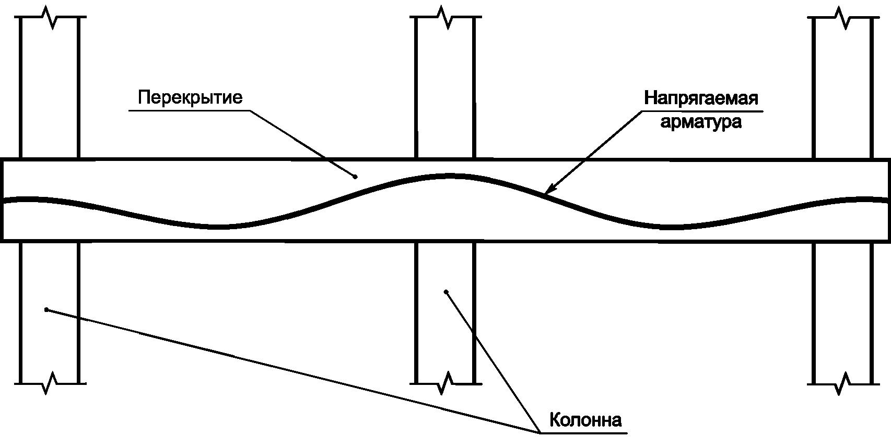

Рисунок 5.7 — Схема раскладки напрягаемой арматуры без сцепления с бетоном в эксплуатационной стадии по высоте сечения вдоль неразрезной конструкции перекрытия

5.2.14 Основные конструктивные параметры плоских плит перекрытий — размеры поперечного сечения (толщина плиты), класс бетона по прочности на сжатие и содержание продольной арматуры, определяемые в зависимости от нагрузки на перекрытие и длины пролетов.

При проектировании рекомендуется принимать оптимальные конструктивные параметры перекрытий, устанавливаемые на основе технико-экономического анализа. При этом толщину плит плоских перекрытий рекомендуется принимать не менее 160 мм, класс бетона — не менее B20. Толщину ребристых и кессонных плит рекомендуется принимать не менее 250 мм и не более 500 мм, класс бетона — не менее B25.

В первом приближении толщину плоских плит перекрытия в каркасных и смешанных конструктивных системах рекомендуется назначать не менее //30, в стеновых конструктивных системах — не менее //35, где / — длина наибольшего пролета плиты.

В дальнейшем толщину плоских плит перекрытия при необходимости корректируют с учетом требований по ограничению деформаций (прогиба) плит и прочности на продавливание.

5.2.15 В плоских плитах перекрытий и покрытия на густоармированных участках, вокруг колонн, где действуют максимальные поперечные силы, изгибающие и крутящие моменты, для предотвраще-

ния продавливания, упрощения армирования и облегчения бетонирования допускается применение

фибробетона класса по остаточной прочности на растяжение не менее  $ B_{ft3}2 $ . Размеры участков плиты

из фибробетона в этом случае назначают из условия обеспечения прочности на продавливание по его

границе с основным бетоном плиты.

5.2.16 В необходимых случаях в местах расположения вертикальных несущих элементов колонн, пилонов и у торцов стен в горизонтальных конструкциях безбалочных перекрытий предусматривают поперечное армирование, определяемое расчетом на продавливание.

## 6 Требования к расчету монолитных конструктивных систем

### 6.1 Основные принципы расчета конструктивных систем и их элементов

6.1.1 Монолитные конструктивные системы и их несущие элементы проверяют расчетами по предельным состояниям двух групп, а также по особым предельным состояниям согласно 5.1.1 ГОСТ 27751—2014.

6.1.2 По результатам расчета определяют усилия, возникающие в основных несущих элементах и конструкциях, а также их узлах. На действие полученных усилий выполняют расчеты по прочности, трещиностойности и деформациям несущих элементов и узлов согласно СП 63.13330 и настоящему своду правил.

Кроме того, по результатам расчета монолитных конструктивных систем оценивают эксплуатационную пригодность конструктивной системы на соответствие нормативным документам. Для этого определяют ряд основных параметров конструктивной системы (согласно 6.2.1 и 6.4), значения которых сравнивают с предельно допустимыми значениями, приведенными в СП 20.13330, СП 22.13330, СП 63.13330 и других нормативных документах.

По результатам указанных расчетов производят окончательное конструирование несущих элементов и узлов с учетом СП 63.13330 и настоящего свода правил.

При необходимости, предусмотренной нормативными документами, также следует выполнять расчеты монолитных конструктивных систем по особым предельным состояниям, возникающим при особых воздействиях и ситуациях, на устойчивость против прогрессирующего обрушения.

6.1.3 Расчет монолитных конструктивных систем на устойчивость против прогрессирующего об-

рушения выполняют с учетом требований ГОСТ 27751, СП 296.1325800, СП 385.1325800. Данный рас-

чет должен обеспечивать прочность и устойчивость конструктивной системы в случае гипотетического

локального разрушения его конструкций, как минимум, на время, необходимое для эвакуации людей.

Расчет на прогрессирующее обрушение рекомендуется производить, принимая нелинейные жесткости элементов конструктивной системы. Допускается на начальных стадиях расчета принимать не-

линейные жесткости элементов по 6.2.9.

### 6.2 Требования к расчету конструктивных систем

6.2.1 Для определения основных параметров монолитных конструктивных систем необходимо выполнять следующие расчеты:

- усилий, возникающих в несущих элементах и узлах, по результатам общего расчета конструктивной системы на всех стадиях (возведения и эксплуатации);

- горизонтальных перемещений верха;

- первых форм собственных колебаний;

- формы и устойчивости положения (опрокидывание);

- перекосов этажных ячеек (при расчетах конструкций фасадов);

- максимальной (средней) осадки, относительной разности осадок фундамента;

- прогибов плит перекрытий;

- ускорений колебаний перекрытий верхних этажей.

6.2.2 Расчеты конструктивной системы в общем случае следует выполнять в пространственной постановке с учетом совместной работы надземной и подземной части здания (сооружения), а также фундамента и основания под ним.

6.2.3 Расчеты конструктивной системы следует выполнять для стадии возведения с учетом ста-

дийности (при существенном изменении расчетной ситуации) и для стадии эксплуатации, принимая

расчетные схемы, соответствующие рассматриваемым стадиям. При этом следует учитывать:

- порядок приложения и изменения вертикальной нагрузки и жесткостей в процессе возведения и эксплуатации;

- образование трещин от температурно-усадочных деформаций бетона в процессе твердения и наличие технологических швов при бетонировании захватками;

- прочность и деформационные характеристики бетона в момент освобождения конструкции от опалубки и передачи нагрузки от вышележащих этажей.

6.2.4 Расчет монолитных конструктивных систем производят с применением линейных и нелинейных жесткостей железобетонных элементов.

Линейные жесткости железобетонных элементов, осуществляющие связь усилий с упругими (ли- нейными) деформациями, определяют как для сплошного упругого тела.

Нелинейные жестости железобетонных элементов определяют по поперечному сечению элементов с учетом возможного образования трещин и развития неупругих (нелинейных) деформаций в бето-не и арматуре, соответствующих кратковременному и длительному действиям нагрузки.

6.2.5 Значения нелинейных жесткостей железобетонных элементов следует устанавливать в зависимости от стадии расчета, требований к расчету и характера напряженно-деформированного состояния элемента.

На первой стадии расчета конструктивной системы, характеризуемой тем, что армирование же-

лезобетонных элементов неизвестно, нелинейную работу элементов допускается учитывать, применяя

нелинейную жесткость, определяемую понижением их линейных жесткостей (или модуля упругости бе-

тона) с помощью условных понижающих коэффициентов.

На последующих стадиях расчета конструктивной системы, когда известно армирование железо-

бетонных элементов, в расчет следует вводить в зависимости от вида определяемого параметра кон-

структивной системы (6.2.1) уточненные значения нелинейных жесткостей элементов, учитывающие

армирование, образование трещин и развитие неупругих деформаций в бетоне и арматуре согласно

СП 63.13330.

6.2.6 В результате расчета монолитной конструктивной системы должны быть установлены:

- значения продольных и поперечных сил, изгибающих моментов и крутящих моментов (в необходимых случаях) — в колоннах;

- значения изгибающих моментов, крутящих моментов, поперечных и продольных сил — в пло-

ских плитах перекрытий, покрытия и фундаментов;

- значения продольных и сдвигающих сил, изгибающих моментов, крутящих моментов и поперечных сил — в пилонах и стенах.

6.2.7 На первой стадии расчета для оценки усилий в элементах монолитной конструктивной системы допускается принимать линейные жесткости элементов, имея в виду, что распределение усилий в элементах монолитной конструктивной системы зависит не от значения, а, в основном, от соотношения жесткостей этих элементов. Для более точной оценки распределения усилий в элементах конструктивной системы рекомендуется на данной стадии расчета принимать приближенные значения нелинейных жесткостей с учетом условных понижающих коэффициентов (6.2.5). При этом необходимо учитывать существенное снижение жесткостей в изгибаемых плитных элементах (в результате возможного образования трещин) по сравнению с внецентренно сжатыми элементами.

В первом приближении рекомендуется принимать значения понижающих коэффициентов равными:

0,6 — для вертикальных сжатых несущих элементов;

0,3 — для несущих горизонтальных элементов.

По найденным усилиям определяют армирование элементов конструктивной системы, которое учитывают при определении жесткостей элементов согласно СП 63.13330, применяемых для уточнения усилий на последующих стадиях расчета.

6.2.8 Предельно допустимое значение ускорения колебаний в уровне перекрытия верхнего этажа здания устанавливают в соответствии с СП 20.13330. Расчет ускорений колебаний перекрытий верхнего этажа производят при действии нормативного значения пульсационной составляющей ветровой нагрузки с коэффициентом 0,7 согласно СП 20.13330 для оценки комфортности пребывания людей. Жесткости элементов конструктивной системы принимают линейными. Работу основания допускается не учитывать.

6.2.9 Горизонтальные перемещения верха конструктивной системы определяют при действии нагрузок, соответствующих расчетной ситуации по предельным состояниям второй группы (постоянные, длительные и кратковременные вертикальные и горизонтальные нагрузки с коэффициентом надежности по нагрузке, равным 1,0). Расчет выполняют по деформированной схеме, принимая нелинейные пониженные значения жесткостей элементов конструктивной системы (6.2.5), т. к. горизонтальные перемещения напрямую зависят от жесткостных свойств элементов.

В первом приближении значения условных понижающих коэффициентов допускается принимать равными:

0,6 — для вертикальных несущих элементов;

0,2 — для горизонтальных несущих элементов при наличии трещин;

0,3 — для горизонтальных несущих элементов при отсутствии трещин.

При определении горизонтальных перемещений верха конструктивной системы необходимо учитывать работу основания.

Горизонтальные перемещения верха здания (сооружения) не должны превышать предельно до-пустимых значений, установленных СП 20.13330.

Допускается определять горизонтальные перемещения верха по недеформированной схеме, при- нимая линейные жесткости элементов. При этом значение горизонтальных перемещений верха здания (сооружения) не должно превышать  $ h/1000 $ , где  $ h $  — высота здания (сооружения) согласно таблице Д.4 СП 20.13330.2016.

6.2.10 Прогибы плит перекрытий и покрытий определяют при действии нагрузок, соответствующих расчетной ситуации по предельным состояниям второй группы, с коэффициентом надежности по нагрузке, равным 1,0. На первой стадии расчета допускается принимать нелинейные пониженные значения жесткостей элементов конструктивной системы согласно 6.2.9 с учетом работы горизонтальных несущих конструкций при наличии трещин, т. к. вертикальные перемещения плит напрямую зависят от их жесткостных свойств.

На последующих стадиях расчета при известном армировании следует принимать уточненные жесткости плит с учетом армирования, наличия трещин и неупругих деформаций в бетоне и арматуре, определяемые согласно СП 63.13330 и др.

Предельно допустимое значение прогибов устанавливают в соответствии с СП 20.13330.

6.2.11 При расчете на устойчивость конструктивной системы следует проверять устойчивость формы конструктивной системы, а также устойчивость положения конструктивной системы на опрокидывание и на сдвиг.

Расчет на устойчивость конструктивной системы выполняют на действие расчетных значений по-

стоянных, длительных и кратковременных вертикальных и горизонтальных нагрузок, соответствующих

предельным состояниям первой группы, с учетом работы основания.

При расчете устойчивости формы конструктивной системы принимают нелинейные пониженные жесткости ее элементов, поскольку устойчивость конструктивной системы связана с деформативностью системы и отдельных элементов. Допускается принимать нелинейные жесткости элементов конструктивной системы с применением условных понижающих коэффициентов. При этом значения условных понижающих коэффициентов в первом приближении принимают с учетом 6.2.9, исходя из работы горизонтальных несущих конструкций при наличии трещин.

Запас по устойчивости формы конструктивной системы должен быть не менее чем двукратным. Запас по устойчивости формы характеризует превышение нагрузки на конструктивную систему, при которой возникает возможность потери общей устойчивости здания (сооружения), над расчетной, соответствующей предельным состояниям первой группы.

При расчете устойчивости положения (опрокидывание и сдвиг) конструктивные системы следует рассматривать как жесткое недеформированное тело. Расчет конструктивной системы на опрокидывание выполняют на действие опрокидывающего (от горизонтальной нагрузки) и удерживающего (от вертикальной нагрузки) моментов. Значения моментов определяют относительно крайней точки фун-дамента. При расчете на опрокидывание удерживающий момент должен превышать опрокидывающий момент с коэффициентом 1,5. При расчете на сдвиг удерживающая горизонтальная сила должна пре- вышать действующую сдвигающую силу с коэффициентом 1,2. При этом следует учитывать наиболее неблагоприятные значения коэффициентов надежности по нагрузке.

6.2.12 Расчет перекосов вертикальных этажных ячеек от неравномерности вертикальных деформаций соседних несущих конструкций (стен, пилонов, колонн) выполняют для расчета внутренних и наружных ограждающих конструкций (перегородок, фасадов). Расчет выполняют с учетом стадии возведения, а также времени и длительности приложения нагрузок, принимая нелинейные жесткости элементов конструктивной системы. В расчете необходимо учитывать работу основания.

Нелинейные жесткости вертикальных и горизонтальных элементов допускается принимать со-

гласно 6.2.9 с учетом работы горизонтальных несущих конструкций при наличии трещин.

Перекосы вертикальных ячеек не должны превышать предельно допустимого значения, приведенного в таблице Д.4 СП 20.13330.2016.

6.2.13 Расчет основания (несущей способности и деформации) следует выполнять в соответствии с СП 22.13330, СП 24.13330 и другими действующими нормативными документами. Расчет выполня-

ют на действие усилий, полученных по результатам расчета общей конструктивной системы при не-

благоприятных расчетных сочетаниях нагрузок, соответствующих рассматриваемой расчетной ситуа-

ции. Предельные осадки и относительную разность осадок основания ограничивают в соответствии с

СП 22.13330.

Возникающие вследствие деформаций основания крены здания (сооружения) должны быть ограничены, исходя из условий эксплуатации технологического оборудования, указанных в задании на проектирование.

6.2.14 Расчет конструктивных систем с плитами перекрытий и покрытий, содержащих напрягае-мую арматуру, следует выполнять с учетом приложения А.

6.2.15 Расчет монолитных конструктивных систем на стадии их возведения с учетом снятия и перестановки опалубки выполняют при необходимости установления требуемой распалубочной прочности бетона, методов выдерживания и ухода за бетоном и других технологических факторов, влияющих на скорость возведения здания.

Расчет выполняют в пространственной постановке. Жесткостные характеристики элементов при-

нимают как для сплошного упругого тела. Принимают пониженную прочность бетона и соответствующий

ей модуль упругости на ранней стадии твердения бетона, принимая во внимание, что возраст бетона к

моменту распалубливания меньше требуемого для достижения бетоном прочности, соответствующей

принятому классу бетона.

По результатам расчета определяют действующие усилия в железобетонных конструкциях и оце-нивают их несущую способность, жесткость и трещиностойкость согласно СП 63.13330. Если прочность и трещиностойкость конструкций недостаточны, а для перекрытий прогибы завышены, увеличивают прочность бетона и расчет выполняют вновь вплоть до выполнения требований по прочности, трещи-ностойкости и деформациям.

Снятие-перестановка опалубки с ненагруженных железобетонных элементов возможно только по достижении требуемой прочности бетона в них, определяемой из расчета на монтажные нагрузки и нагрузку от собственного веса. При этом необходимое условие для горизонтальных элементов — достижение требуемой прочности нижележащих вертикальных элементов.

Снятие-перестановка опалубки с нагруженных элементов возможно только по достижении требу-

емой прочности бетона в них, определяемой из расчета на монтажные нагрузки, нагрузку от собствен-

ного веса и других вышерасположенных конструкций.

При необходимости могут быть рассмотрены промежуточные стадии распалубливания (опалубочные щиты сняты, стойки остаются или частично убираются), при этом в расчетах учитывают работу оставшихся стоек опалубки.

6.2.16 При расчете монолитных конструктивных систем следует учитывать температурные воз-

действия эксплуатационного и строительного периодов.

К температурным воздействиям эксплуатационного периода относят климатические колебания температуры наружного воздуха и эксплуатационный подогрев (или охлаждение) конструктивной системы.

Температурные воздействия строительного периода определяют с учетом экзoterмии и других условий твердения бетона, включая конструктивные и технологические мероприятия по регулированию температурного режима конструкции, температура замыкания и т. п.

Расчет выполняют из условия проверки образования температурно-усадочных трещин, при котором сравнивают значение растягивающих напряжений в железобетонном элементе, действующих в результате температурно-усадочных воздействий, и сопротивление бетона на растяжение в возрасте, соответствующем рассматриваемой расчетной ситуации.

Температурные воздействия принимают в виде максимальной температуры установленного для конструкции температурного поля с учетом температуры окружающей среды. Усадочные воздействия учитывают путем введения предельного значения усадочных деформаций [2]. Температурные поля же-

лезобетонных элементов определяют методами строительной физики.

### 6.3 Требования к расчету железобетонных конструкций

6.3.1 В общем случае расчеты железобетонных элементов монолитной конструктивной системы выполняют согласно СП 63.13330 и настоящему своду правил.

6.3.2 Расчет несущих железобетонных элементов монолитной конструктивной системы (колонн, пилонов, стен, балок, плит перекрытий и покрытий, фундаментов) и их узлов сопряжений следует про- изводить по предельным состояниям двух групп: по несущей способности (по прочности и устойчиво-

сти) и по эксплуатационной пригодности (по трещиностойкости и деформациям). При этом расчет на устойчивость отдельных сжатых элементов (колонн, пилонов, стен) выполняют в рамках их расчета по прочности с учетом влияния продольного изгиба или в рамках расчета конструктивной системы по деформированной схеме. Расчет элементов по деформациям в общем случае выполняют в рамках расчета статически неопределимой конструктивной системы. Допускается производить расчет элементов по деформациям, выделяя их из конструктивной системы с соответствующими граничными условиями и нагрузками.

6.3.3 Расчет по прочности колонн следует производить по нормальным сечениям на действие изгибающих моментов и продольных сил и по наклонным сечениям на действие поперечных и продольных сил, полученных по результатам общего расчета конструктивной системы (6.2.1).

Расчет по прочности колонн по нормальным сечениям выполняют по предельным усилиям или с применением деформационной модели согласно СП 63.13330.2012 (8.1.14—8.1.17, 8.1.20—8.1.30).

В общем случае влияние продольного изгиба учитывают расчетом конструктивной системы по деформированной схеме, определяя деформации железобетонных элементов с учетом их неупругой работы и наличия трещин. При расчете конструктивной системы по недеформированной схеме влияние продольного изгиба следует учитывать умножением изгибающих моментов или экспедиции продольной силы на коэффициент, определяемый в зависимости от условной критической силы согласно 8.1.15 СП 63.13330.2012.

6.3.4 Расчет по прочности плоских плит перекрытий, покрытий и фундаментных плит следует производить в общем случае согласно 8.1.53—8.1.55 СП 63.13330.2012 как плоских выделенных элементов на совместное действие изгибающих и крутящих моментов, а также на действие продольных и поперечных сил, полученных из общего расчета конструктивной системы.

Допускается выполнять расчеты по прочности элементов плит по предельным усилиям согласно 8.1 СП 63.13330.2012 как линейных выделенных изгибаемых элементов единичной ширины с учетом соответствующих граничных условий и нагрузок.

Расчет по прочности нормальных сечений предварительно напряженных плит перекрытий с натяжением арматуры на бетон и с напрягаемой арматурой без сцепления с бетоном выполняют согласно приложению А.

6.3.5 Расчет по трещиностойкости плит (по образованию и раскрытию трещин, нормальных к продольной оси элемента) следует производить на действие изгибающих моментов (без учета крутящих моментов) согласно 8.1.59 СП 63.13330.2012.

6.3.6 Расчет по прочности стен следует производить в общем случае согласно 8.1.56—8.1.58 СП 63.13330.2012 как плоских выделенных элементов на совместное действие нормальных сил, изгибающих и крутящих моментов, а также на действие сдвигающих и поперечных сил, полученных из общего расчета конструктивной системы.

Допускается выполнять расчеты по прочности элементов стен по предельным усилиям согласно 8.1 СП 63.13330.2012 как линейных выделенных внецентренно сжатых элементов единичной ширины с учетом соответствующих граничных условий и нагрузок.

6.3.7 Расчет по прочности массивных горизонтальных конструкций фундаментных или переходных плит производят преимущественно при использовании в расчетах объемных конечных элементов. Растягивающие усилия при этом должны быть восприняты продольной, поперечной или фибровой арматурой, а сжимающие усилия — бетоном. При этом следует учитывать предельно допустимые деформации и сопротивления материалов согласно разделу 6 СП 63.13330.2012.

6.3.8 Расчет плоских плит перекрытий, покрытий и фундаментных плит на продавливание сосредоточенными нагрузками в общем случае выполняют согласно 8.1.46—8.1.52 СП 63.13330.2012.

Расчет несущих горизонтальных конструкций на продавливание выполняют при действии сосредоточенной силы и изгибающих моментов, определенных из общего статического расчета.

Расчет плит на продавливание около торцов стен производят для расчетного контура поперечного сечения плиты, расположенного у торца стены, на расстоянии  $ h_{0}/2 $  от контура поперечного сечения стены и состоящего из трех участков: первого участка, расположенного параллельно торцу стены, и двух участков, расположенных параллельно длине стены и равных длине участка, параллельного торцу стены (рисунок 6.1).

При расположении торцов стен у края плиты помимо указанного выше расчетного контура плиты рассматривают также расчетный контур, состоящий из двух прямолинейных участков, следующих от края плиты на расстоянии  $ h_{0}/2 $  от граней стены вдоль длины стены на расстояние от торца стены, равное толщине стены (рисунок 6.1, 6).

Расчет производят по правилам, приведенным в 8.1.46 СП 63.13330.2012. При этом сосредоточенную нормальную силу F от внешней нагрузки, действующую на рассматриваемое расчетное по-перечное сечение плиты, принимают равной равнодействующей всех поперечных сил, действующих по длине рассматриваемого контура поперечного сечения плиты, а сосредоточенный момент M учитывают только в направлении Y (из плоскости стены) и принимают при расчете плиты на продавливание равным половине разности изгибающих моментов в плите, действующих по обе стороны стены на участках контура расчетного поперечного сечения плиты, параллельных длине стены (рисунок 6.1, а).

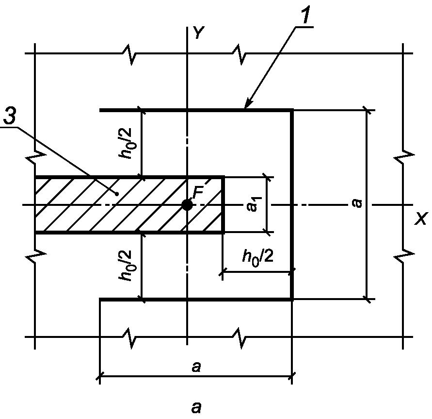

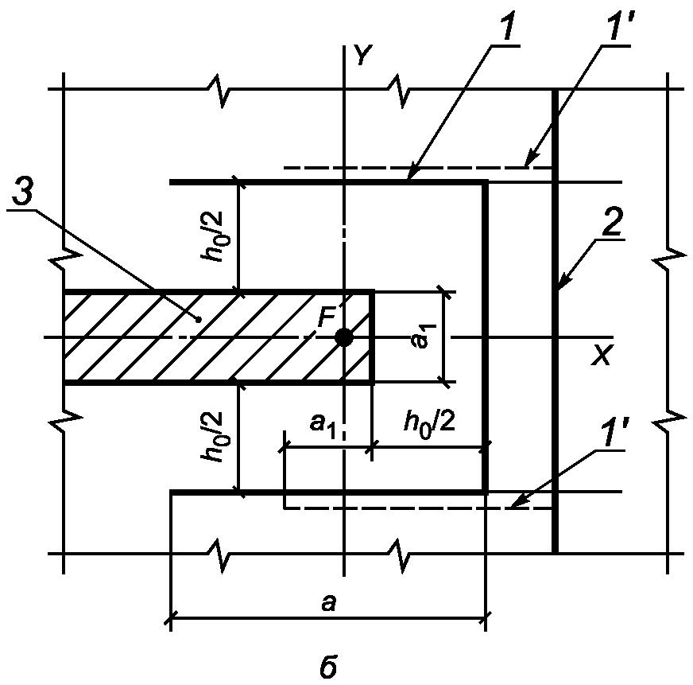

а — около стен, расположенных внутри площади плит; 6 — около стен, расположенных у края плит; 1 — контур расчетного поперечного сечения; 1' — второй вариант расположения контура расчетного поперечного сечения; 2 — край плиты; 3 — площадь приложения нагрузки

Рисунок 6.1 — Схемы расчетных контуров поперечного сечения при продавливании плоских плит

Расчет плиты на продавливание около угла стены производят только на действие продольной силы F (без учета момента), принимаемой равной равнодействующей поперечных сил, действующих на длине всех участков контура расчетного поперечного сечения плиты согласно рисунку 6.2.

Расчет подвешенной к вышележащей стене плиты на продавливание (отрыв) производят аналогично вышеуказанным случаям, но по контуру расчетного поперечного сечения плиты, отстоящего от крайних стержней подвешивающей плиту арматуры, определяемой из расчета на отрыв, на расстоянии  $ h_{0}/2 $  (рисунок 6.3). При необходимости постановки поперечной арматуры на продавливание подвешивающие стержни в расчете не учитывают.

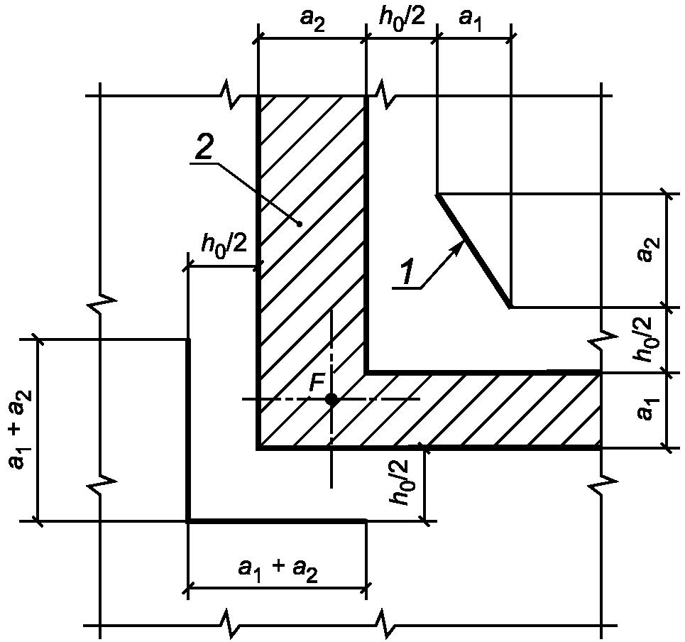

1 — контур расчетного поперечного сечения; 2 — площадь приложения нагрузки

Рисунок 6.2 — Схема расчетных контуров поперечного сечения при продавливании плоских плит около углов стен

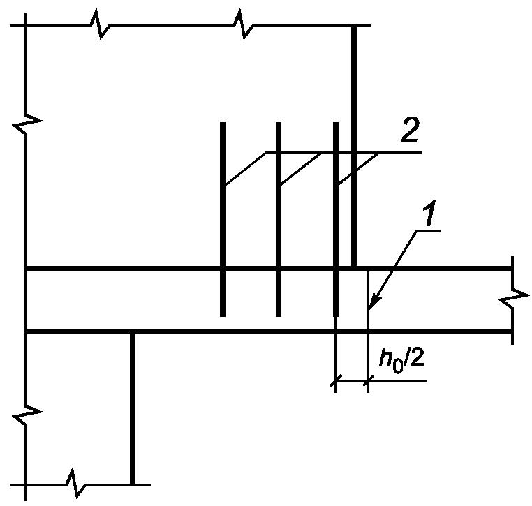

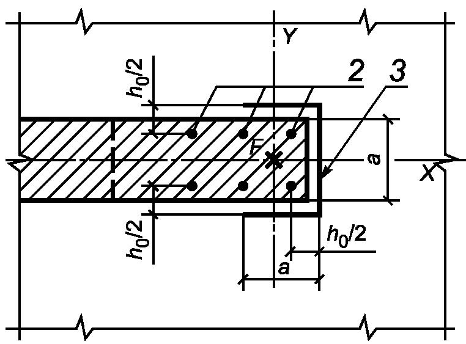

1 — расчетное поперечное сечение; 2 — подвешивающие арматурные стержки; 3 — контур расчетного поперечного сечения

Рисунок 6.3 — Схема для расчета на продавливание плоской плиты при подвеске перекрытия к вышележащей стене

При определении расчетного контура поперечного сечения на продавливание необходимо учитывать фактическое положение отверстий в опорных зонах несущих горизонтальных конструкций.

6.3.9 На опорах изгибаемых конструкций с подрезкой (например, сопряжения балок или плит в зонах деформационных швов) необходимо выполнять проверку прочности по сжатой наклонной полосе короткой консоли подрезки, и проверку прочности наклонных сечений на действие поперечных сил и изгибающих моментов (рисунок 6.4).

В общем случае расчеты по наклонным сечениям выполняют согласно 8.1.31—8.1.35 СП 63.13330.2012. При этом в качестве рабочей высоты сечения принимают рабочую высоту короткой консоли  $ h_{01} $ , образованной подрезкой, а в случае отсутствия анкеровки продольной арматуры в зоне подрезки расчет по наклонным сечениям следует выполнять на действие поперечных сил и изгибающих моментов, увеличенных на 20 %.

Расчет короткой консоли подрезки производят согласно приложению Ж СП 63.13330.2012, принимая направление наклонной сжатой полосы от наружного края площадки опирания до равнодействующей усилий в поперечной подвешивающей арматуре на уровне сжатой арматуры конструкции.

При отсутствии анкеровки нижней арматуры в зоне подрезки конструкции следует выполнять проверку прочности наклонного сечения, расположенного вне подрезки и начинающегося на расстоянии не менее  $ h_{0}-h_{01} $  от торца. При этом в расчете не учитывают продольную арматру короткой консоли, а длину проекции С принимают не менее расстояния от начала наклонного сечения до конца указанной арматуры.

Для смежной конструкции с подрезкой выполняют аналогичные проверки.

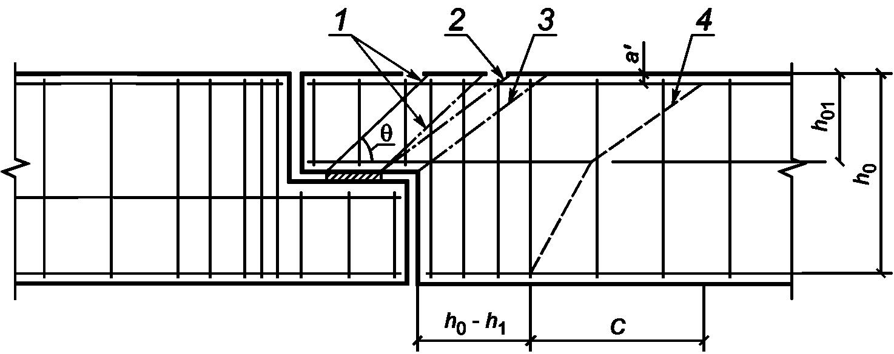

1 — наклонная сжатая полоса; 2 — наклонное сечение для расчета на действие поперечных сил; 3 — наклонное сечение для расчета на действие изгибающих моментов и поперечных сил; 4 — наклонное сечение для расчета на действие изгибающих моментов и поперечных сил вне подрезки

Рисунок 6.4 — Расположение расчетных наклонных сечений для расчета конструкций с подрезками

6.3.10 Для узлов сопряжений балок различных направлений с различной высотой поперечного сечения необходимо выполнять проверку прочности балок большей высоты поперечного сечения на отрыв от действия опорных реакций примыкающих балок меньшей высоты поперечного сечения. Опорные реакции определяют из общего расчета конструктивной системы и прикладывают в пределах высоты сечения или к нижней грани балок большей высоты поперечного сечения (рис. 6.5). Расчет на отрыв производят из условия

 $$ F\cdot\left(1-\frac{h_{s}}{h_{0}}\right)\leq\sum R_{s w}A_{s w}, $$ 

где F — опорная реакция примыкающего элемента (балки, консоли);

$h_{s}$ — расстояние от центра тяжести сжатой зоны примыкающего элемента до центра тяжести продольной арматуры;

$\sum R_{sw}A_{sw}$ — сумма поперечных усилий, воспринимаемых хомутами, установленными дополнительно сверх требуемых по расчету наклонного или пространственного сечения согласно 8.1.32—8.1.42 СП 63.13330.2012. Хомуты располагают на длине зоны отрыва, равной

 $$ a=2h_{s}+b, $$ 

где  b — ширина примыкающего элемента;

$h_{s}$ — расстояние от центра тяжести сжатой зоны примыкающего элемента до центра тяжести продольной арматуры $A_{s}$.

При этом высоту сжатой зоны опорного сечения примыкающего элемента допускается принимать равной x/0,8, где x — высота сжатой зоны, определенная из расчета по прочности и принимаемая не менее 2a'.

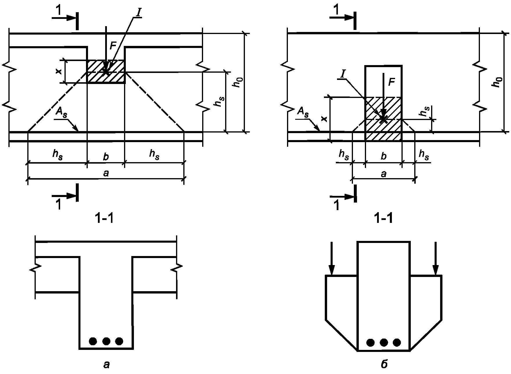

а — при примыкании балок; 6 — при примыкании консолей; / — центр тяжести сжатой зоны примыкающего элемента

Рисунок 6.5 — Схема для определения длины зоны отрыва

### 6.4 Методы расчета и расчетные модели монолитных конструктивных систем

6.4.1 Расчет монолитных конструктивных систем производят в общем случае методами строительной механики.

6.4.2 Для расчета монолитных конструктивных систем разрабатывают расчетные схемы, включающие данные о нагрузках и воздействиях (сбор нагрузок), а также физическую (расчетную) модель.

Разработку расчетных моделей конструктивных систем следует выполнять преимущественно в пространственной постановке с учетом работы основания. Расчетная модель представляет собой трехмерную систему из монолитных колонн, стен, пилонов, плит, балок, фундаментов, узлов их сопряжений и основания.

Расчетная модель должна соответствовать принятым проектным решениям в части геометриче-

ских параметров и физико-механических свойств материалов, включать в себя данные о нагрузках и

воздействиях на здание (сооружение) и его элементы.

6.4.3 Распределение усилий в пространственно-деформируемых системах в значительной степени обусловлено жесткостными характеристиками элементов и их сопряжениями, которые зависят как

от материала и его напряженного состояния, так и от типа конструкции, качества возведения, наличия дефектов, истории загружения, влажности материала, температура и др. Влияние всех факторов при проектировании учесть сложно. Поэтому геометрические параметры и физические характеристики материалов и конструкций в расчетах принимают заданными.

6.4.4 Расчеты напряженно-деформированного состояния железобетонных линейных, плоских и объемных элементов и их сопряжений разработаны только для нормальных сечений при простых воз- действиях.

Методики расчетов по наклонным и пространственным сечениям с трещинами разработаны для частных случаев, а для сложных воздействий и учета многих факторов применяют различные упрощения.

6.4.5 Сложные пространственные геометрические схемы упрощают заменой реальной конструкции условной схемой. Ребристый и пустотный диски перекрытий так же, как и структурное покрытие из стержней, заменяют условной анизотропной пластиной постоянной толщины. Колонны и балки ап-проксимируют стержнями, приведенными к оси, а плиты и стены — оболочками (пластинами), приведенными к срединной плоскости. При фактической несоосности двух смежных несущих конструкций одного этажа или конструкций смежных этажей следует учитывать эксцентриситеты положения осей и срединных плоскостей конструкций.

6.4.6 Пространственная монолитная конструктивная система — статически неопределимая система. Для расчета несущих конструктивных систем применяют дискретные расчетные модели, рассчитываемые численными методами (преимущественно методом конечных элементов — МКЭ). Допускается применять упрощенные расчетные модели (одно- и двухмерные) на предварительных этапах проектирования.

Расчет регулярных (или близких к ним) каркасных и стеновых конструктивных систем также может быть выполнен методом заменяющих (эквивалентных) рам (6.4.12).

Для оценки несущей способности перекрытий может быть применен расчет методом предельного равновесия.

6.4.7 При выполнении расчетов конструктивной системы численными методами следует применять специальные верифицированные и сертифицированные в Российской Федерации программные комплексы, учитывающие требования СП 14.13330, СП 16.13330, СП 20.13330, СП 22.13330, СП 24.13330, СП 63.13330.

6.4.8 При выполнении расчетов методом конечных элементов дискретизацию конструктивных систем производят с применением оболочечных, стержневых и объемных (при необходимости) конечных элементов, используемых в принятом для расчетов программном комплексе.

При создании пространственной модели конструктивной системы необходимо учитывать характер совместной работы стержневых, оболочечных и объемных конечных элементов, связанных с различным числом степеней свободы для каждого из указанных элементов.

6.4.9 Деформативные свойства основания следует учитывать использованием общепринятых расчетных моделей основания, применением различных типов конечных элементов или краевых условий с заданной податливостью, моделирования всего массива грунта под зданием (сооружением) из объемных конечных элементов или комплексно — с применением всех вышеперечисленных методов в случае сложной совместной работы конструкции фундамента и основания.

На первой стадии расчета конструктивной системы допускается учитывать деформативность основания с помощью единого коэффициента постели по всей площади основания, принимаемого по усредненным характеристикам грунтов.

При использовании свайных или свайно-плитных фундаментов сваи следует моделировать как железобетонные конструкции или учитывать их совместную работу с грунтом обобщенно, как единое основание с использованием приведенного коэффициента постели основания.

6.4.10 При построении конечно-элементной расчетной модели размеры и конфигурацию конечных элементов следует задавать, исходя из возможностей применяемых конкретных программных комплексов, и принимать такими, чтобы была обеспечена необходимая точность определения усилий по длине колонн и по площади плит перекрытий, фундаментов, пилонов и стен с учетом общего числа конечных элементов в расчетной системе, влияющего на продолжительность расчета.

6.4.11 Жесткости конечных элементов на первой стадии расчета конструктивной системы, когда армирование конструкций еще неизвестно, следует определять по подразделу 6.2.

После определения на этой стадии расчета усилий в элементах конструктивной системы и соответствующего армирования плит перекрытий и покрытий производят дополнительный расчет конструк-

тивной системы для уточнения прогибов этих конструкций, принимая уточненные значения изгибных деформационных характеристик конечных элементов плит с учетом армирования в двух направлениях согласно СП 63.13330.

Аналогичный дополнительный расчет производят для более точной оценки изгибающих моментов в элементах перекрытий, покрытий и фундаментных плитах, а также продольных сил в стенах, колон-

нах и пилонах с учетом в изгибных и осевых нелинейных деформационных характеристиках элементов

деформаций арматуры и бетона вплоть до их предельных значений.

6.4.12 Расчет регулярной конструктивной системы методом заменяющих (эквивалентных) рам производят путем выделения отдельных рам вертикальными сечениями, проходящими по середине шага колонн, в двух взаимно перпендикулярных направлениях (рисунок 6.6).

Расчет выделенных в каждом направлении рам, состоящих из колонн и полос плоской плиты (условного ригеля), следует производить независимо друг от друга по общим правилам строительной механики на действие вертикальных и горизонтальных нагрузок, принимая при определении усилий линейные жесткости элементов рам.

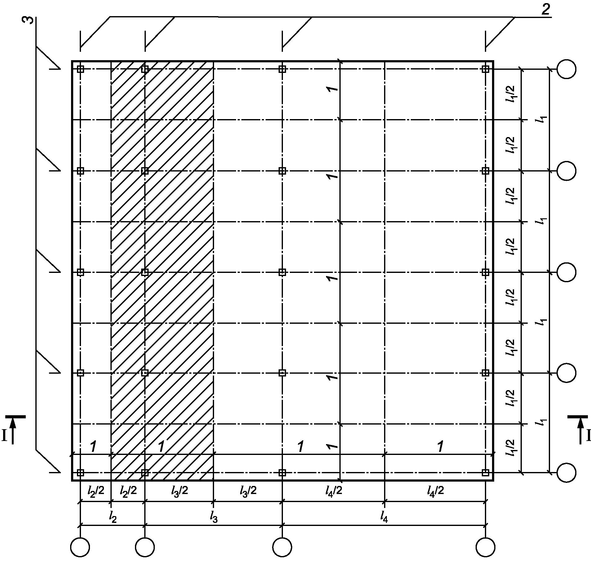

1-1

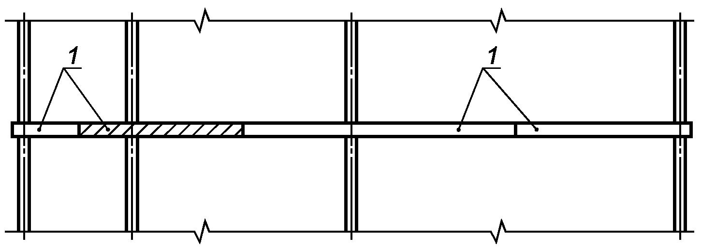

1 — заменяющие рамы; 2, 3 — оси заменяющих рам соответственно в продольном и поперечном направлениях Рисунок 6.6 — Разделение конструктивной системы на заменяющие рамы

Изгибающие моменты и поперечные силы в опорных и пролетных сечениях условного ригеля распределяют между его надколонными и межколонными полосами в зависимости от расположения колонн в раме (крайняя или промежуточная колонна) и соотношения между поперечными и продольными (вдоль оси рамы) пролетами.

6.4.13 Расчет стеновой конструктивной системы на горизонтальные нагрузки допускается выполнять методом разделения перекрестной конструктивной системы на независимые поперечную и продольную схемы.

Горизонтальные нагрузки принимают действующими в обоих направлениях. При допущении аб-

солютной жесткости плит перекрытий в своей плоскости горизонтальные перемещения и углы наклона

всех несущих стен будут одинаковыми при симметричных в плане схемах и нагрузках. С учетом этого

допускается принимать все стены одного направления, расположенные в одной плоскости, соединен-

ными последовательно друг с другом в уровне перекрытий шарнирными связями, абсолютно жесткими

вдоль своей оси. При несущих монолитных наружных стенах следует учитывать участки примыкающих

стен перпендикулярного направления.

6.4.14 Расчет несущей способности плит перекрытий и покрытий методом предельного равновесия следует производить, используя в качестве критерия равенство работ внешних нагрузок и внутренних сил на перемещениях в предельном равновесии плиты перекрытия с наиболее опасной схемой излома, характеризующей ее разрушение [3].

6.4.15 На начальной стадии расчета для ориентировочной оценки жесткости принятой конструктивной системы высотных зданий (5.1.6) допускается выполнять расчет системы на устойчивость и горизонтальное перемещение по условной стержневой консольной схеме, включающей только стены, ядра жесткости и колонны (с линейными деформационными характеристиками), жестко заделанные в основании и объединенные шарнирно примыкающими к ним жесткими дисками перекрытий.

## 7 Конструирование несущих железобетонных конструкций

7.1 В общем случае конструирование несущих железобетонных элементов монолитных конструктивных систем выполняют согласно СП 63.13330 и настоящему своду правил.

7.2 Арматура (рабочая и конструктивная) в любом случае должна иметь защитный слой бетона, обеспечивающий ей защиту от коррозии, а также сцепление и совместную работу арматуры с бетоном. Толщину защитного слоя следует назначать с учетом возможных отклонений, связанных с технологией арматурных и бетонных работ согласно 10.3.1—10.3.4 СП 63.13330.2012, а также с учетом требуемого предела огнестойкости для конструкции.

7.3 Минимальное расстояние между стержнями арматуры принимают с учетом обеспечения укладки и уплотнения бетона железобетонного элемента и совместной работы арматуры и бетона.

Обеспечение укладки и уплотнения бетона зависит от состава бетонной смеси (подвижности бетонной смеси, размеров крупного заполнителя) и расположения арматуры по отношению к направлению укладки бетона.

Минимальное расстояние между стержнями арматуры для обеспечения совместной работы ар-

матуры и бетона устанавливают в зависимости от диаметра арматурных стержней согласно 10.3.5

СП 63.13330.2012.

7.4 Максимальное расстояние между стержнями арматуры (продольной и поперечной) принимают из условий обеспечения совместной работы арматуры и бетона, эффективного вовлечения в работу бетона и арматуры — одни из основных требований применения расчетных положений СП 63.13330.

Максимальное расстояние между стержнями арматуры для различного типа железобетонных элементов устанавливают согласно подразделу 10.3 СП 63.13330.2012.

7.5 На концах арматурные стержни должны иметь анкеровку, обеспечивающую восприятие усилий, действующих в арматурном стержне. Анкеровку устраивают путем заведения арматурного стержня на необходимую длину, достаточную для восприятия усилий, действующих в арматурном стержне в рассматриваемом сечении (прямая анкеровка — рисунок 7.1, а).

В качестве базовой длины прямой анкеровки принимают ее значение, требуемое для восприятия предельного усилия в арматурном стержке, соответствующего расчетному сопротивлению арматурной стали согласно 10.3.26 СП 63.13330.2012.

Анкеровку растянутой арматуры допускается выполнять путем загиба арматурных стержней, устройства крюков на концах арматурных стержней, приварки поперечных стержней (рисунок 7.1, б—д). Кроме этого, анкеровку выполняют с помощью стальных элементов (пластин, уголков и шайб), при-

вариваемых на концах арматурных стержней, а также с помощью специальных анкерных устройств (высаженных головок и т. п.). При таких способах анкеровки должна быть обеспечена прочность бетона на смятие под этими анкерами и прочность бетона на выкалывание, когда арматур анкеруют за пределами рассматриваемого элемента. Расчет производят согласно 8.1.43—8.1.45 СП 63.13330.2012.

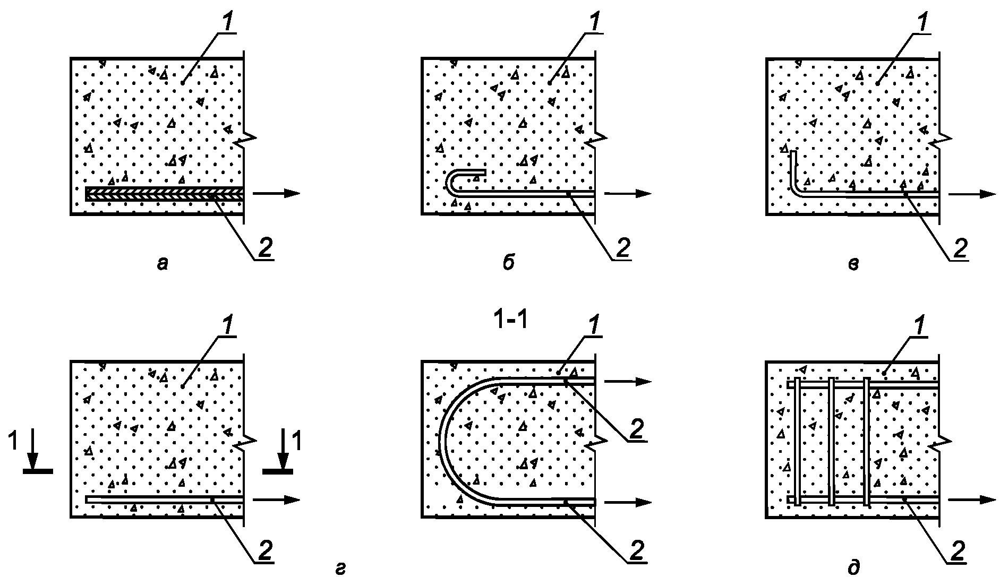

а — сцеплением прямых стержней с бетоном; 6 — крюками; 6 — лапками; 2 — петлями; д — приваркой поперечных стержней; 1 — бетон; 2 — анкеруемый стержень

Рисунок 7.1 — Анкеровка рабочей арматуры в бетоне элемента

7.6 При конструировании арматурных изделий и закладных деталей рекомендуется стремиться к сокращению числа их типоразмеров как в пределах железобетонного элемента, так и в пределах ряда железобетонных конструкций.

7.7 В монолитных железобетонных колоннах концы продольных рабочих стержней, не привариваемые к анкерующим деталям, должны отстоять от торца элемента на расстоянии не менее 15 мм — для колонн длиной до 6 м включительно при диаметре стержней арматуры до 40 мм включительно и 20 мм — в остальных случаях.

7.8 Стержни продольной рабочей арматуры монолитных колонн рекомендуется назначать оди-

накового диаметра. Диаметр рабочей продольной арматуры в колоннах рекомендуется принимать не

менее 12 мм. В случае если продольная арматура конструируется из стержней разных диаметров,

стержни большего диаметра располагают в углах поперечного сечениях колонны.

7.9 В монолитных колоннах многоэтажных зданий стыки рабочей продольной арматуры устраивают на уровне верха перекрытий. Стыки выполняют, как правило, вразбежку. При этом в пределах стыка предусматривают установку поперечной арматуры (хомутов) с шагом не более 10 диаметров стержня продольной арматуры (по наименьшему диаметру).

При высоте этажа менее 3,6 м или при продольной арматуре диаметром более 28 мм стыки рекомендуется устраивать через этаж.

Выпуски стержней из колонны с большим поперечным сечением нижнего этажа в колонну с меньшим поперечным сечением верхнего этажа, а также колонн одинакового поперечного сечения рекомендуется выполнять согласно рисунку 7.2. При этом перевод стержней из одного этажа колонны в другой осуществляется путем их отгиба с уклоном не более 1:6 (рисунок 7.2, а, 6). Часть стержней колонны нижнего этажа может быть доведена до верха перекрытия (рисунок 7.2, 6) и не заводится в колонну верхнего этажа, если она не требуется там по расчету. В случае значительной разницы в сечениях

колонн верхнего и нижнего этажей выпуски следует устраивать установкой специальных стержней в количестве, необходимом для колонны верхнего этажа (рисунок 7.2, в).

Анкеровка и стыки арматуры внахлестку во всех случаях должны сооответствовать СП 63.13330.

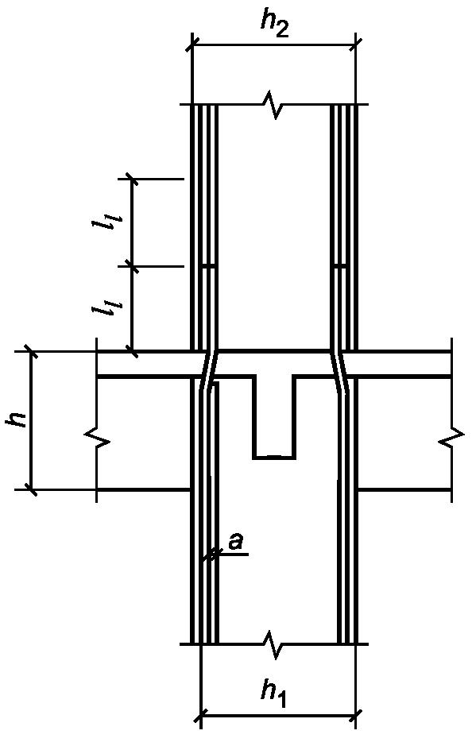

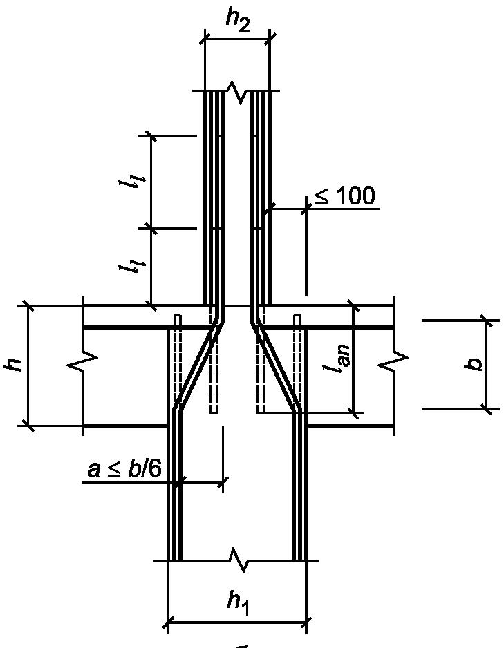

6

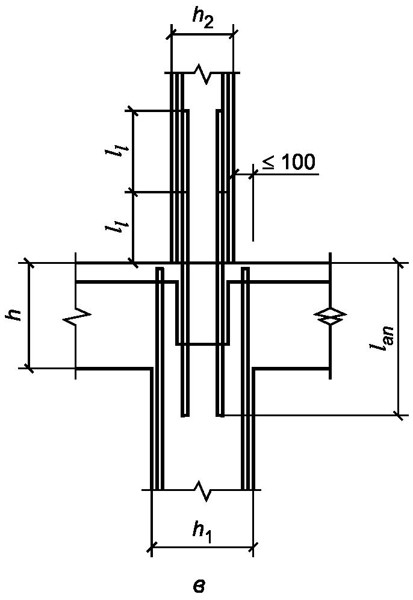

а — при одинаковом поперечном сечении колонн верхнего и нижнего этажей; б — при незначительном различии в сечениях колонн верхнего и нижнего этажей; ∅ — при значительном различии в сечениях колонн верхнего и нижнего этажей

Рисунок 7.2 — Схема устройства стыков продольной рабочей арматуры монолитных колонн

многоэтажных зданий

7.10 В одном поперечном сечении колонны все продольные стержни должны быть охвачены не-прерывным поясом хомутов, при этом концы хомутов должны иметь крюки и перехлестываться, а места перехлеста хомутов ( в том числе по длине колонны) должны быть смещены по отношению друг к другу (рисунок 7.3).

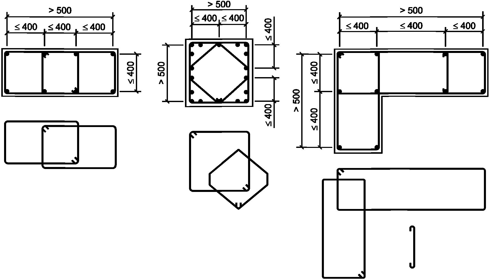

Рисунок 7.3 — Примеры охвата поперечной вязаной арматурой нескольких продольных стержней в различных формах поперечных сечений монолитных колонн

7.11 Для продольной рабочей вязаной арматуры монолитных балок высотой сечения 400 мм и более рекомендуется применять стержни диаметром не менее 12 мм.

Продольную рабочую арматуру балок рекомендуется назначать из стержней одинакового диаметра. В случае применения стержней разных диаметров, стержни большего диаметра размещают в первом ряду, в углах сечения и в местах перегиба хомутов. Расположение вязаной арматуры в сечении монолитных балок приведено на рисунке 7.4. Схемы армирования поперечных сечений монолитных балок вязаными каркасами приведены на рисунке 7.5, при этом закрытые хомуты перевязывают враз-бежку.

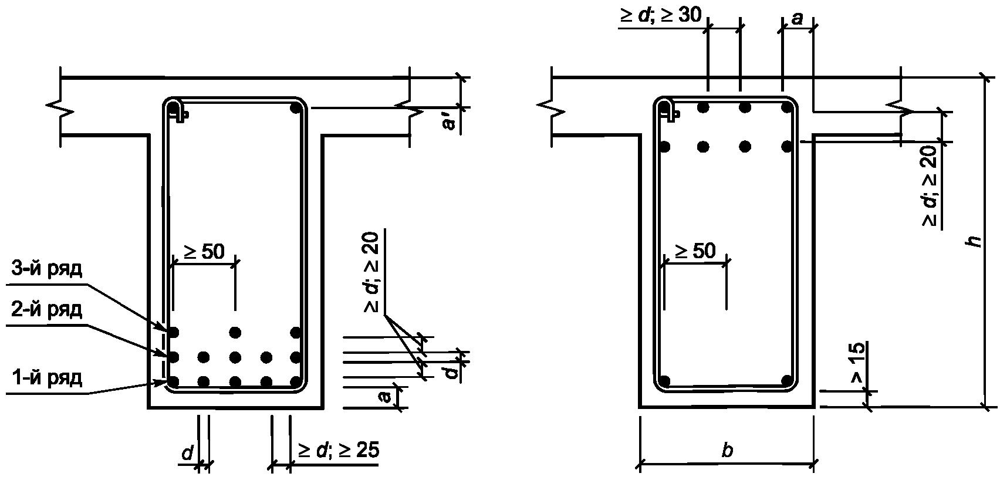

Рисунок 7.4 — Расположение вязаной арматуры в поперечном сечении монолитных балок

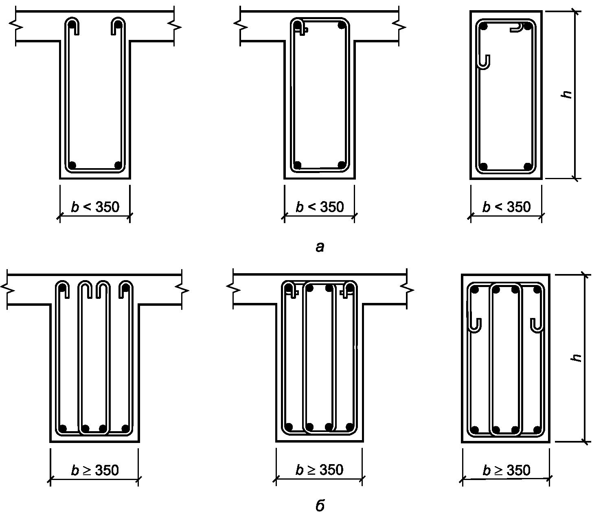

а — двухсрезными хомутами; 6 — четырехсрезными хомутами

Рисунок 7.5 — Схемы армирования сечений монолитных балок вязаной арматурой

Хомуты открытой конструкции допускается применять в вязаных каркасах средних балок, в том числе многопролетных неразрезных, монолитно связанных по верху плитой по всей длине при полной расчетной нагрузке на перекрытие не более 15 кН/м².

Рекомендуется, чтобы каждый хомут охватывал в одном ряду не более пяти растянутых стержней и не более трех сжатых. При большем числе стержней в одном ряду, а также при ширине монолитной балки 350 мм и более рекомендуется переходить на четырехсрезные или многосрезные хомуты.

7.12 В сечениях монолитных балок, где приложены сосредоточенные нагрузки, в т. ч. в местах опирания монолитных второстепенных балок на главные (6.3.10), следует предусматривать дополнительное армирование по рисунку 7.6.

а — сварными сетками; 6 — подвесками; 8 — с учащением шага хомутов

Рисунок 7.6 — Дополнительное армирование балок в местах сосредоточенных нагрузок

7.13 Отверстия значительных размеров (более 300 мм) в железобетонных элементах (плитах, стенах и т. п.) должны быть окаймлены дополнительной арматурой, сечением не менее сечения рабочей арматуры (того же направления), которая требуется по расчету элемента как сплошного (рисунок 7.7, а).

Отверстия размером до 300 мм специальными стержнями не обрамляют. Вязаную рабочую и распределительную арматуру элементов вокруг таких отверстий сгущают путем установки двух стержней с шагом 50 мм (рисунок 7.7, 6). При армировании сварными сетками такое отверстие рекомендуется вырезать в арматуре по месту.

Отверстия (проемы) в плитах, если необходимо по расчету, обрамляют армированными ребрами. Размеры и армирование ребер принимают в зависимости от их размеров, формы, расположения в пла- не относительно балок перекрытия, назначения проема.

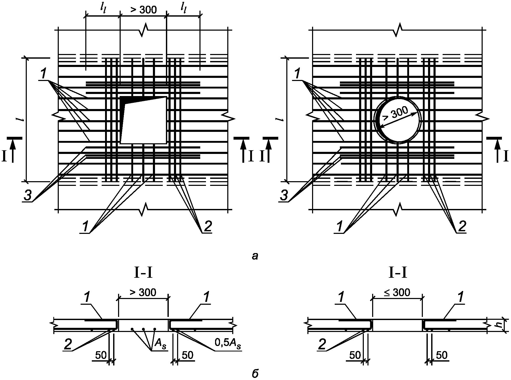

а — отверстие размером более 300 мм; б — отверстие размером 300 мм и менее; 1 — стержни арматуры плиты; 2 — окаймляющие стержни, образованные сгущением арматуры плиты; 3 — стержни специальной окаймляющей отверстие арматуры

Рисунок 7.7 — Армирование плит в местах отверстий

## Приложение А

## Общие положения по проектированию монолитных конструктивных систем с плитами перекрытий и покрытий с напрягаемой арматурой

А.1 При выборе конструктивных систем зданий, содержащих предварительно напряженные конструкции с натяжением на бетон, следует стремиться к соответствующей компоновке конструктивной системы.

Компоновку конструктивной системы производят для наиболее эффективного использования усилий предварительного напряжения и максимального ограничения дополнительных усилий (эффекты второго порядка), которые возникают в несущих конструкциях от усилий предварительного напряжения и должны быть учтены в расчете конструктивной системы.

Дополнительные усилия могут приводить к образованию технологических доэксплуатационных трещин в конструкциях перекрытий (рисунок А.1). Кроме того, нерациональная компоновка конструктивной системы может привести к потерям значительной части предварительного напряжения и образованию чрезмерных дополнительных усилий от обжатия в вертикальных конструкциях. Дополнительные усилия могут потребовать увеличения армирования.

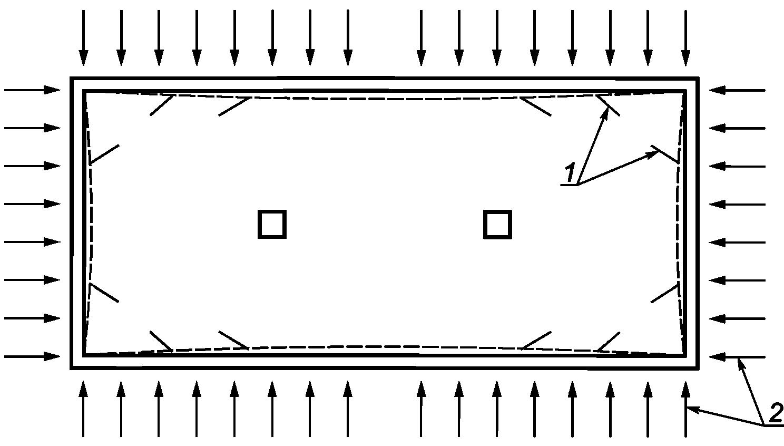

1 — трещины; 2 — усилия обжатия

Рисунок А.1 — Образование доэксплуатационных трещин при обжатии перекрытий, связанных с наружными несущими стенами

Для ограничения указанных негативных явлений предусматривают следующие конструктивные мероприятия:

- у крайних и угловых колонн и стен предусматривают консольные участки перекрытий;

- уменьшают крайние пролеты для снижения опорных моментов у крайних колонн и рационального размещения напрягаемых элементов;

- расположение диафрагм и ядер жесткости проектируют с их максимально близким размещением к геоме-трическому центру плана плит перекрытий (рисунок А.2);

- по возможности максимально снижают жесткость крайних и угловых колонн, а также пилонов и стен в на-

правлении действия усилий обжатия;

- применяют по возможности равнопролетные перекрытия.

Примеры нерекомендуемых компоновок конструктивных систем представлены на рисунке А.3.

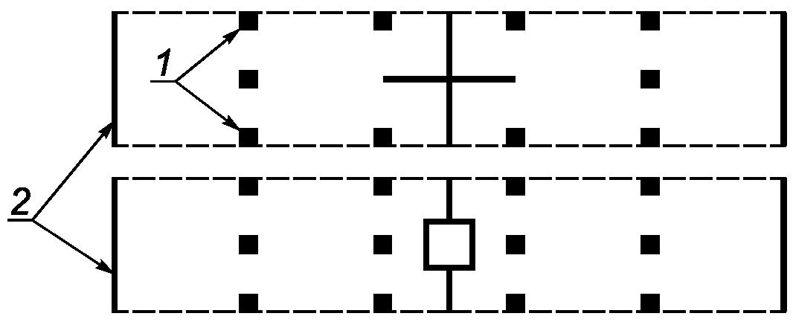

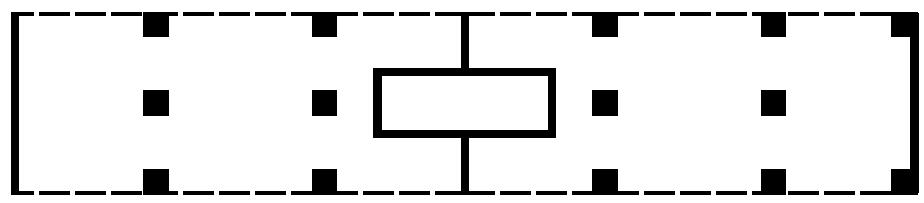

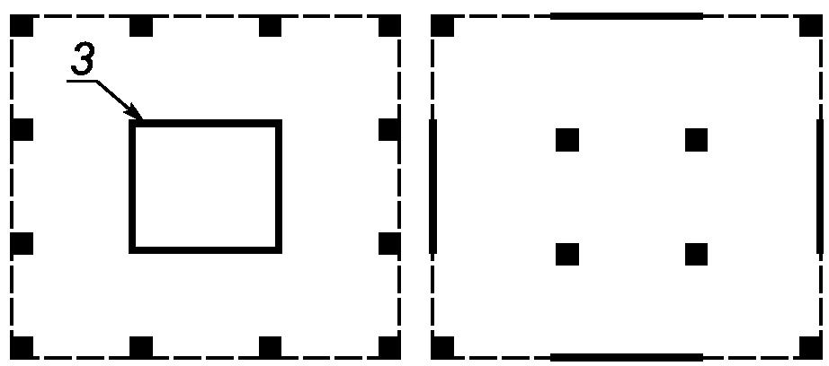

1 — колонны; 2 — стены; 3 — ядра жесткости

Рисунок А.2 — Примеры рекомендуемых компоновок конструктивных систем

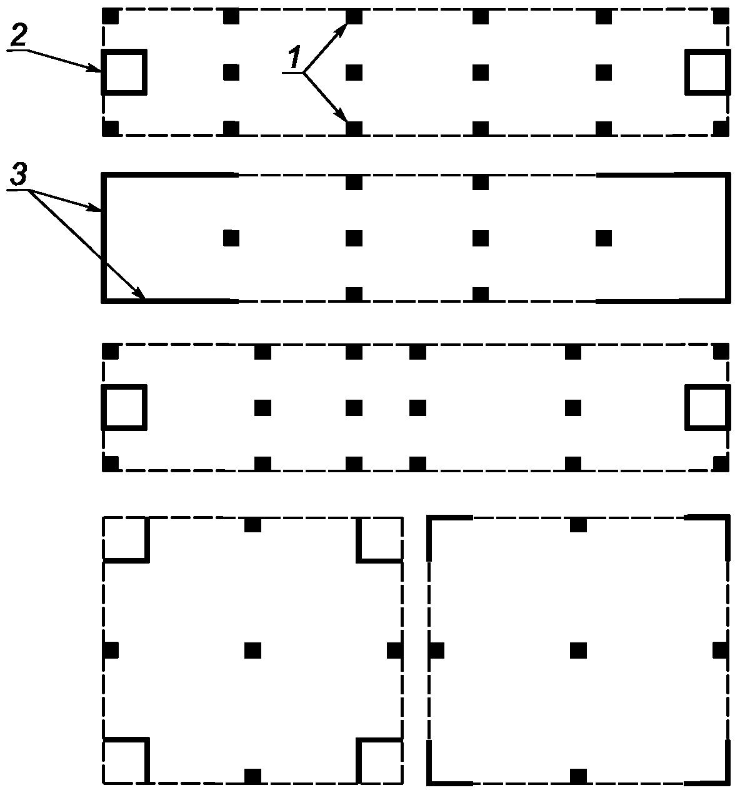

1 — колонны; 2 — ядра жесткости; 3 — стены

Рисунок А.3 — Примеры нерекомендуемых компоновок конструктивных систем

А.2 При расчетах предварительно напряженных конструкций перекрытий следует учитывать усилия предварительного напряжения и дополнительные поперечные силы, возникающие от усилий обжатия.

А.3 При расчетах предварительно напряженных конструкций с применением метода конечных элементов усилия предварительного напряжения для систем без сцепления арматуры с бетоном можно задавать как не-посредственно для отдельных конечных элементов модели с учетом траектории усилий, так и в виде равномер-но распределенных нагрузок. Отдельные программные комплексы позволяют задавать непосредственно усилия предварительного напряжения для отдельных конечных элементов модели.

А.4 На первой стадии расчета для оценки усилий в элементах конструктивной системы с предварительно на-пряженными перекрытиями жесткости элементов в первом приближении принимают с учетом начального модуля упругости бетона принятого класса с понижающими коэффициентами:

- 0,6 — для вертикальных сжатых элементов;

- 0,7 — для плит перекрытий (покрытий) с учетом длительности действия нагрузки.

На последующих стадиях расчета жесткости следует определять согласно СП 63.13330.

А.5 При определении прогибов из плоскости плит перекрытий и покрытий в конструктивных системах с предварительно напряженными перекрытиями в первом приближении значения понижающих коэффициентов относительно начального модуля упругости бетона с учетом длительности действия нагрузки допускается принимать: для вертикальных несущих элементов — 0,6, а для плит перекрытий (покрытий) — 0,7 при наличии трещин или 0,9 — при отсутствии трещин.

А.6 Расчет предварительно напряженных плит перекрытий со сцеплением арматуры с бетоном производят в соответствии с СП 63.13330.

Расчет по прочности нормальных сечений предварительно напряженных плит без сцепления арматуры с бетоном следует производить с учетом практически свободного (без сцепления) равномерного деформирования арматуры по длине конструкции, не подобного распределению действующих изгибающих моментов от нагрузки, согласно А.7—А.10.

А.7 Расчет по прочности нормальных сечений железобетонных конструкций без сцепления арматуры с бетоном (рисунок 5.7) допускается производить на основе предельных усилий по двум вариантам.

По первому варианту расчет выполняют как для обычных элементов, определяя внутренние усилия в сечении с учетом только ненапрягаемой арматуры согласно подразделу 8.1 СП 63.13330.2012, принимая усилие от предварительного натяжения арматуры как внешнюю сжимающую продольную силу, равную

 $$ N_{p}=(\sigma_{s p}+\Delta\sigma_{s,u})A_{s p}\leq0,85R_{s}A_{s p}, $$ 

где  $ \sigma_{sp} $  — предварительное напряжение с учетом всех потерь и коэффициента  $ \gamma_{sp} = 0,9 $ ;

Δσs,u — приращение напряжения в арматуре от внешней нагрузки. Допускается принимать приближенно Δσs,u = 100 МПа.

По второму варианту расчет производят, определяя внутренние усилия в сечении элемента с учетом обычной и предварительно напряженной арматуры, принимая усилие предварительного напряжения как часть предельного усилия в напрягаемой арматуре, согласно А.8 и А.9.

А.8 Расчет нормальных сечений железобетонных конструкций без сцепления арматуры с бетоном согласно второму варианту производят из условия (8.3) СП 63.13330.2012, где значения предельного изгибающего момента  $ M_{ult} $ , который может быть воспринят сечением элемента, определяют по формуле

 $$ M_{u l t}=R_{b}\cdot b\cdot x\left(h_{0}-\frac{x}{2}\right)+R_{s c}\cdot A_{s}^{^{\prime}}\left(h_{0}-a\right)-R_{s}\cdot A_{s}\left(a_{s p}-a\right) $$ 

или по формуле

 $$ M_{u l t}=\sigma_{s,u}\cdot A_{s p}\cdot\left(h_{0}-\frac{x}{2}\right)+R_{s}\cdot A_{s}\left(h-a-\frac{x}{2}\right)+R_{s c}\cdot A_{s}^{^{\prime}}\left(\frac{x}{2}-a^{\prime}\right) $$ 

При этом высоту сжатой зоны х принимают равной

 $$ x=\frac{\sigma_{s,u}\cdot A_{s p}+R_{s}\cdot A_{s}-R_{s c}\cdot A_{s}^{\prime}}{R_{b}\cdot b}, $$ 

здесь  $ \sigma_{s,u} $  — напряжение в преднапряженной арматуре в предельном по прочности состоянии, определяемое по формуле

 $$ \sigma_{s,u}=\sigma_{s p}+\Delta\sigma_{s,u}\leq0,85R_{s}, $$ 

где  $ \sigma_{sp} $  — предварительное напряжение в арматуре с учетом всех потерь и  $ \gamma_{sp} = 0,9 $ ;

Δσ_{s,u} — приращение напряжений в арматуре от внешней нагрузки в предельном состоянии, определяемое по формуле (A.6) в зависимости от относительной высоты сжатой зоны бетона ξ =  $ \frac{x}{h_{0}} $ 

 $$ \Delta\sigma_{s,u}=150\left(\frac{0,4}{\xi}-1\right). $$ 

Высоту сжатой зоны х определяют из совместного решения (А.4) и (А.6) с учетом формулы (А.5) или из урав-

нения

 $$ x^{2}-A\cdot x-B=0, $$ 

rde

 $$ A=\frac{\left(\sigma_{s p}-150\right)A_{s p}+R_{s}\cdot A_{s}-R_{s c}\cdot A_{s}^{\prime}}{R_{b}\cdot b}, $$ 

 $$ B=\frac{60h_{0}\cdot A_{s p}}{R_{b}\cdot b}. $$ 

По найденной высоте сжатой зоны х или  $ ξ = \frac{x}{h_b} $  проверяют значение  $ σ_{s,u} $  с использованием формул (A.5) и (A.6) и принимают его не более  $ 0,85R_s $  ( $ σ_{s,u} ≤ 0,85R_s $ ).

В тех случаях, когда найденное значение  $ \sigma_{s,u} $  требует ограничения, значение высоты сжатой зоны определяют по формуле (А.4), подставляя в нее

 $$ \sigma_{s,u}=0,85R_{s}. $$ 

А.9 Значение  $ M_{ult} $  для элементов с полкой, сжатой от действия внешней нагрузки, определяют в зависимости от положения границы сжатой зоны бетона:

а) если граница проходит в полке, т. е. соблюдается условие

 $$ \sigma_{s u1}\cdot A_{s p}+R_{s}\cdot A_{s}\leq R_{b}\cdot b_{f}^{\prime}\cdot h_{f}^{\prime}+R_{s c}\cdot A_{s}^{\prime}, $$ 

значение $M_{ult}$ определяют как для прямоугольного сечения шириной $b'_{f}$ (А.8).

В формуле (A.11) напряжение $\sigma_{su1}$ определяют по формуле (A.5) с учетом формулы (A.6), где $\xi=\frac{h_{f}'}{h_{0}}$,

б) если граница проходит в ребре, т. е. условие (А.11) не соблюдается, значение  $ M_{ult} $  определяют по формуле (8.7) СП 63.13330.2012, принимая высоту сжатой зоны равной

 $$ \boldsymbol{x}=\frac{\sigma_{s,u}\cdot\boldsymbol{A}_{s p}+\boldsymbol{R}_{s}\cdot\boldsymbol{A}_{s}-\boldsymbol{R}_{s c}\cdot\boldsymbol{A}_{s}^{^{\prime}}-\boldsymbol{R}_{b}\left(b_{f}^{^{\prime}}-b\right)h_{f}^{^{\prime}}}{\boldsymbol{R}_{b}\cdot\boldsymbol{b}} $$ 

с учетом формул (А.5) и (А.6) для напряжения $\sigma_{su}$ и его ограничения значением $0,85R_{s}$.

А.10 Расчет нормальных сечений для предварительно напряженных плит без сцепления арматуры с бетоном по нелинейной деформационной модели производят в соответствии с 8.1.20—8.1.30 СП 63.13330.2012. В уравне-

ниях равновесия внешних сил и внутренних усилий в нормальном сечении элемента внешние силы определяют с

учетом усилия обжатия, которое вводится в расчет как внешняя продольная сила.

В уравнениях (8.26), (8.27), (8.28) СП 63.13330.2012,  $ M_{x} $ ,  $ M_{y} $  — изгибающие моменты от внешней нагрузки относительно выбранных и располагаемых в пределах поперечного сечения элемента координатных осей (соответственно действующих в плоскостях ХОЗ и УОЗ или параллельно им). Указанные изгибающие моменты определяют по формулам:

 $$ M_{x}=M_{x d}-N_{p}\cdot\mathbf{e}_{x}; $$ 

 $$ M_{y}=M_{y d}-N_{p}\cdot\mathbf{\Theta}_{y}, $$ 

где  $ M_{xd} $   $ M_{yd} $  — изгибающие моменты в соответствующих плоскостях от внешней нагрузки, определяемые из статического расчета конструкции;

 $$ N_{p}\mathrm{~-~}\mathrm{c m.~формулу~(A.1)}. $$ 

 $ e_{x}, e_{y} $  — расстояния от точки приложения усилия обжатия  $ N_{p} $  до соответствующих выбранных осей;

## Библиография

[1] Федеральный закон от 22 июля 2008 г. № 123-ФЗ «Технический регламент о требованиях пожарной безопасности»

[2] Рекомендации по учету ползучести и усадки бетона при расчете бетонных и железобетонных конструкций. — М., 1988

[3] Руководство по расчету статически неопределимых железобетонных конструкций. — М., 1975

УДК 624.012.3/.4

Ключевые слова: конструктивная система, несущие элементы, монолитные железобетонные конструкции, расчетные модели, расчет по прочности, расчет по трещиностойкости, расчет по деформациям

Технический редактор В.Н. Прусакова

Корректор Е.Д. Дульнева

Компьютерная верстка Е.А. Кондрашовой

Сдано в набор 10.04.2019. Подписано в печать 14.05.2019. Формат 60×84%. Гарнитура Ариал Усл. печ. л. 5,12. Уч.-изд. л. 4,63.

Подготовлено на основе электронной версии, предоставленной разработчиком свода правил

Создано в единичном исполнении во ФГУП «СТАНДАРТИНФОРМ» для комплектования Федерального информационного фонда стандартов, 117418 Москва, Нахимовский пр-т, д. 31, к. 2.

www.gostinfo.ru info@gostinfo.ru

